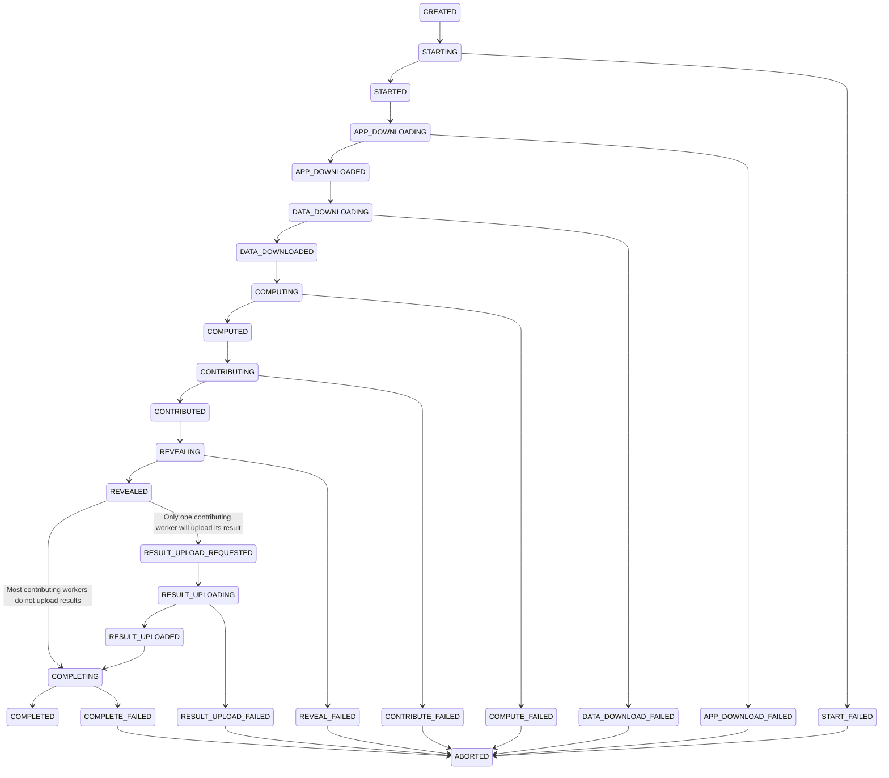

# Task Feedback

## Debug your app on iExec

Sometimes things don't work out right the first time and you may need to debug your application.

- Get debug information of a _task_

```bash
iexec task debug <taskid> --chain bellecour
```

It allows anyone to know on-chain and off-chain statuses of the _task_.

- Get debug logs of a _task_

```bash
iexec task debug <taskid> --logs --chain bellecour
```

It allows the requester to retrieve application logs produced by workers.

## Off-chain statuses

One _task_ bought by a requester will result in one off-chain _task_ with one or more _replicates_ depending on the level of trust set by the requester. For a given _task_, each worker involved in the computation will have its own _replicate_ containing the description of the _task_ to compute. The whole computation of a _replicate_ is made of several stages. Each stage completed by a worker will result in an update of its _replicate_ status.

The links between a _task_ to its _replicates_ can be represented as follows:

```bash
task1
├── replicate1 (workerX)
├── replicate2 (workerY)
└── replicate3 (workerZ)
```

While the _task_ holds a meta status, each _replicate_ has its own status which can be one of these:

| Replicate status | Description |
| --- | --- |
| `CREATED` | A new _replicate_ is assigned to a worker just after it asked for more work |
| `STARTING` | The worker starts preflight checks to confirm it can work on this _replicate_ |
| `STARTED` | The worker confirms it is going to work on this _replicate_ |
| `START_FAILED` | The worker confirms it is going to work on this _replicate_ |
| `APP_DOWNLOADING` | The worker is downloading the application |
| `APP_DOWNLOADED` | The download of the application is completed |
| `APP_DOWNLOAD_FAILED` | The download of the application failed |
| `DATA_DOWNLOADING` | The worker is downloading the dataset |
| `DATA_DOWNLOADED` | The download of the dataset is completed |
| `DATA_DOWNLOAD_FAILED` | The download of the dataset failed |
| `COMPUTING` | The worker is computing the _task_ |
| `COMPUTED` | The computation is completed |
| `COMPUTE_FAILED` | The computation failed |
| `CONTRIBUTING` | The worker sent the "contribute(..)" transaction (result digest) on chain |
| `CONTRIBUTE_FAILED` | The contribute transaction failed |
| `CONTRIBUTED` | The worker has contributed on chain |
| `REVEALING` | The worker sent the "reveal(..)" transaction (proof that he is the owner of the result digest) |
| `REVEALED` | The worker has revealed the proof on chain |
| `REVEAL_FAILED` | The reveal transaction failed |
| `RESULT_UPLOAD_REQUESTED` | The worker has been requested to upload the result to a remote filesystem |
| `RESULT_UPLOAD_REQUEST_FAILED` | The worker did not accept to be requested to upload the result |
| `RESULT_UPLOADING` | The worker is uploading the result |
| `RESULT_UPLOAD_FAILED` | The upload of the result failed |
| `RESULT_UPLOADED` | The result is uploaded to IPFS (over the _iExec Result Proxy_) |
| `COMPLETING` | The _task_ is finalized, the worker will purge data related to its _replicate_ |
| `COMPLETED` | The whole _task_ is completed meaning the _task_ is finalized. The worker has been rewarded if it is part of the consensus |
| `COMPLETE_FAILED` | The worker failed to clean the local _replicate_ resources after the _task_ is finnalized |
| `FAILED` | The worker failed to participate to the _task_ |
| `ABORTED` | The scheduler asked the worker to stop working on this _replicate_ while the latter was still working on it |
| `RECOVERING` | The worker has been stopped, it is starting back from where it stopped |
| `WORKER_LOST` | The worker didn't ping the iexec-core scheduler for a while. It is considered as out for this _task_ |

The transitions between those states are as follow:



## Cause of off-chain replicates

A _replicate_ can fail with the following causes:

| Replicate failure cause | Description |
| --- | --- |
| `OUT_OF_GAS` | The worker needs some ETH, please refill its wallet |
| `REVEAL_TIMEOUT` | The worker took too long to reveal its proof (more than 2 periods after the consensus) |
