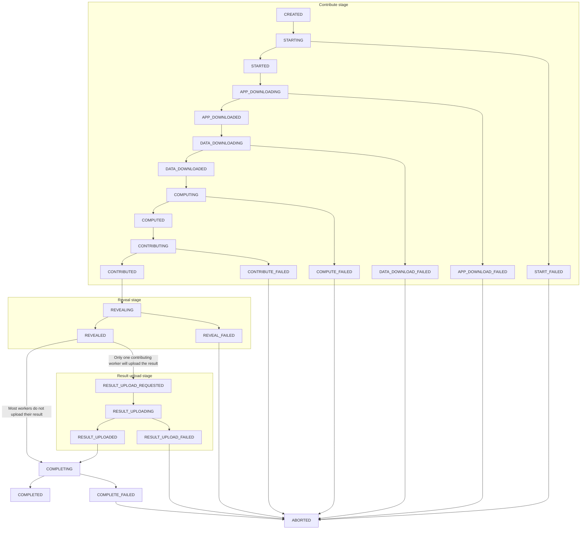

# Task Feedback

## Debug your app on iExec

Sometimes things don't work out right the first time and you may need to debug your application.

- Get debug information of a _task_

```bash
iexec task debug <taskid> --chain bellecour
```

It allows anyone to know on-chain and off-chain statuses of the _task_.

- Get debug logs of a _task_

```bash
iexec task debug <taskid> --logs --chain bellecour
```

It allows the requester to retrieve application logs produced by workers.

## Off-chain statuses

One _task_ bought by a requester will result in one off-chain _task_ with one or more _replicates_ depending on the level of trust set by the requester. For a given _task_, each worker involved in the computation will have its own _replicate_ containing the description of the _task_ to compute. The whole computation of a _replicate_ is made of several stages. Each stage completed by a worker will result in an update of its _replicate_ status.

The links between a _task_ to its _replicates_ can be represented as follows:

```bash
task1
├── replicate1 (workerX)
├── replicate2 (workerY)
└── replicate3 (workerZ)
```

While the _task_ holds a meta status, each _replicate_ has its own status which can be one of these:

| Replicate status | Description |
| --- | --- |
| `CREATED` | A new _replicate_ is assigned to a worker just after it asked for more work |
| `STARTING` | The worker starts preflight checks to confirm it can work on this _replicate_ |
| `STARTED` | The worker confirms it is going to work on this _replicate_ |
| `START_FAILED` | The preflight checks have failed. The worker will NOT work on this _replicate_ |
| `APP_DOWNLOADING` | The worker is downloading the application |
| `APP_DOWNLOADED` | The download of the application is completed |
| `APP_DOWNLOAD_FAILED` | The download of the application failed |
| `DATA_DOWNLOADING` | The worker is downloading the dataset |
| `DATA_DOWNLOADED` | The download of the dataset is completed |
| `DATA_DOWNLOAD_FAILED` | The download of the dataset failed |
| `COMPUTING` | The worker is computing the _task_ |
| `COMPUTED` | The computation is completed |
| `COMPUTE_FAILED` | The computation failed |
| `CONTRIBUTING` | The worker sent the "contribute(..)" transaction (result digest) on chain |
| `CONTRIBUTE_FAILED` | The contribute transaction failed |
| `CONTRIBUTED` | The worker has contributed on chain |
| `REVEALING` | The worker sent the "reveal(..)" transaction (proof that he is the owner of the result digest) |
| `REVEALED` | The worker has revealed the proof on chain |
| `REVEAL_FAILED` | The reveal transaction failed |
| `RESULT_UPLOAD_REQUESTED` | The worker has been requested to upload the result to a remote filesystem |
| `RESULT_UPLOAD_REQUEST_FAILED` | The worker did not accept to be requested to upload the result |
| `RESULT_UPLOADING` | The worker is uploading the result |
| `RESULT_UPLOAD_FAILED` | The upload of the result failed |
| `RESULT_UPLOADED` | The result has been uploaded to IPFS over the _iExec Result Proxy_ (standard or TEE tasks) or to Dropbox (TEE only), dependending on the _deal_ parameters |
| `COMPLETING` | The _task_ is finalized, the worker will purge data related to its _replicate_ |
| `COMPLETED` | The whole _task_ is completed meaning the _task_ is finalized. The worker has been rewarded if it is part of the consensus |
| `COMPLETE_FAILED` | The worker failed to clean the local _replicate_ resources after the _task_ is finalized |
| `FAILED` | The worker failed to participate to the _task_ |
| `ABORTED` | The scheduler asked the worker to stop working on this _replicate_ while the latter was still working on it |
| `RECOVERING` | The worker has been stopped, it is starting back from where it stopped |
| `WORKER_LOST` | The worker didn't ping the iexec-core scheduler for a while. It is considered as out for this _task_ |

The transitions between those states are as follow:



## Off-chain replicates failure causes

When a worker fails to complete a _replicate_, it returns a failure cause. This cause is helpful to understand what went wrong.

### Failures detected by the Scheduler

| Replicate failure cause | Description |
| --- | --- |
| `REVEAL_TIMEOUT` | The worker took too long to reveal its proof (more than 2 periods after the consensus) |

### Failures from Worker

A _replicate_ can fail with the following causes:

#### Common failures

| Replicate failure cause | Replicate status | Description |
| --- | --- | --- |
| `CHAIN_UNREACHABLE` | `STARTING`, `APP_DOWNLOADING`, `DATA_DOWNLOADING`, `COMPUTING`, `CONTRIBUTING` | The task model could not be fetched from the blockchain |
| `STAKE_TOO_LOW` | `STARTING`, `APP_DOWNLOADING`, `DATA_DOWNLOADING`, `COMPUTING`, `CONTRIBUTING` | Worker deposit is too low |
| `TASK_NOT_ACTIVE` | `STARTING`, `APP_DOWNLOADING`, `DATA_DOWNLOADING`, `COMPUTING`, `CONTRIBUTING` | On-chain task status is not `ACTIVE` |
| `CONTRIBUTION_TIMEOUT` | `STARTING`, `APP_DOWNLOADING`, `DATA_DOWNLOADING`, `COMPUTING`, `CONTRIBUTING` | Contribution deadline has already been reached |
| `CONTRIBUTION_ALREADY_SET` | `STARTING`, `APP_DOWNLOADING`, `DATA_DOWNLOADING`, `COMPUTING`, `CONTRIBUTING` | The worker has already contributed |
| `WORKERPOOL_AUTHORIZATION_NOT_FOUND` | `STARTING`, `APP_DOWNLOADING`, `DATA_DOWNLOADING`, `COMPUTING`, `CONTRIBUTING` | The authorization to contribute to the task is missing |
| `APP_IMAGE_DOWNLOAD_FAILED` | `APP_DOWNLOADING` | The download of the `application` image failed |
| `APP_NOT_FOUND_LOCALLY` | `COMPUTING` | The `application` image could not be found on the worker |
| `APP_COMPUTE_FAILED` | `COMPUTING` | The application execution failed |
| `POST_COMPUTE_COMPUTED_FILE_NOT_FOUND` | `COMPUTING` | The  `computed.json` file could not be found |
| `POST_COMPUTE_RESULT_DIGEST_COMPUTATION_FAILED` | `COMPUTING` | The `result digest` could not be computed from the `computed.json` file |
| `POST_COMPUTE_OUT_FOLDER_ZIP_FAILED` | `COMPUTING` | `post-compute` failed to zip the output folder resulting from the computation |
| `POST_COMPUTE_SEND_COMPUTED_FILE_FAILED` | `COMPUTING` | Failed to post `computed.json` to worker |
| `OUT_OF_GAS` | `CONTRIBUTING`, `REVEALING` | The worker needs some ETH, please refill its wallet |
| `DETERMINISM_HASH_NOT_FOUND` | `CONTRIBUTING`, `REVEALING` | The `result digest` could not be read from the `computed.json` file |
| `CHAIN_RECEIPT_NOT_VALID` | `CONTRIBUTING`, `REVEALING` | The transaction failed on the blockchain |
| `CONSENSUS_BLOCK_MISSING` | `REVEALING` | |
| `BLOCK_NOT_REACHED` | `REVEALING` | The worker has not reached the consensus block |
| `CANNOT_REVEAL` | `REVEALING` | One of the mandatory condition was not met. Reveal cannot happen |
| `RESULT_LINK_MISSING` | `UPLOADING` | No result link has been provided by the worker |

#### Specific failures for standard tasks

| Replicate failure cause | Replicate status | Description |
| --- | --- | --- |
| `TASK_DESCRIPTION_INVALID` | `STARTING` | The task description contains inconsistencies and cannot be executed |
| `DATASET_FILE_DOWNLOAD_FAILED` | `DATA_DOWNLOADING` | Dataset download failed |
| `DATASET_FILE_BAD_CHECKSUM` | `DATA_DOWNLOADING` | Downloaded dataset checksum does not match on-chain provided checksum |
| `INPUT_FILES_DOWNLOAD_FAILED` | `DATA_DOWNLOADING` | At least one input file could not be downloaded |

#### Specific failures for TEE tasks

| Replicate failure cause | Replicate status | Description |
| --- | --- | --- |
| `TEE_NOT_SUPPORTED` | `STARTING` | The current worker does not support `TEE` tasks. It may not be well configured or not compatible at all |
| `UNKNOWN_SMS` | `STARTING` | SMS URL could not be resolved for this task |
| `GET_TEE_SERVICES_CONFIGURATION_FAILED` | `STARTING` | Failed to fetch TEE task configuration properties from SMS |
| `TEE_PREPARATION_FAILED` | `COMPUTING` | TEE task preparation step could not be completed, task cannot be executed by the worker |
| `TEE_SESSION_GENERATION_INVALID_AUTHORIZATION` | `COMPUTING` | |
| `TEE_SESSION_GENERATION_EXECUTION_NOT_AUTHORIZED_EMPTY_PARAMS_UNAUTHORIZED` | `COMPUTING` | |
| `TEE_SESSION_GENERATION_EXECUTION_NOT_AUTHORIZED_NO_MATCH_ONCHAIN_TYPE` | `COMPUTING` | |
| `TEE_SESSION_GENERATION_EXECUTION_NOT_AUTHORIZED_GET_CHAIN_TASK_FAILED` | `COMPUTING` | |
| `TEE_SESSION_GENERATION_EXECUTION_NOT_AUTHORIZED_TASK_NOT_ACTIVE` | `COMPUTING` | |
| `TEE_SESSION_GENERATION_EXECUTION_NOT_AUTHORIZED_GET_CHAIN_DEAL_FAILED` | `COMPUTING` | |
| `TEE_SESSION_GENERATION_EXECUTION_NOT_AUTHORIZED_INVALID_SIGNATURE` | `COMPUTING` | |
| `TEE_SESSION_GENERATION_PRE_COMPUTE_GET_DATASET_SECRET_FAILED` | `COMPUTING` | |
| `TEE_SESSION_GENERATION_APP_COMPUTE_NO_ENCLAVE_CONFIG` | `COMPUTING` | |
| `TEE_SESSION_GENERATION_APP_COMPUTE_INVALID_ENCLAVE_CONFIG` | `COMPUTING` | |
| `TEE_SESSION_GENERATION_POST_COMPUTE_GET_ENCRYPTION_TOKENS_FAILED_EMPTY_BENEFICIARY_KEY` | `COMPUTING` | |
| `TEE_SESSION_GENERATION_POST_COMPUTE_GET_STORAGE_TOKENS_FAILED` | `COMPUTING` | |
| `TEE_SESSION_GENERATION_POST_COMPUTE_GET_SIGNATURE_TOKENS_FAILED_EMPTY_WORKER_ADDRESS` | `COMPUTING` | |
| `TEE_SESSION_GENERATION_POST_COMPUTE_GET_SIGNATURE_TOKENS_FAILED_EMPTY_PUBLIC_ENCLAVE_CHALLENGE` | `COMPUTING` | |
| `TEE_SESSION_GENERATION_POST_COMPUTE_GET_SIGNATURE_TOKENS_FAILED_EMPTY_TEE_CHALLENGE` | `COMPUTING` | |
| `TEE_SESSION_GENERATION_POST_COMPUTE_GET_SIGNATURE_TOKENS_FAILED_EMPTY_TEE_CREDENTIALS` | `COMPUTING` | |
| `TEE_SESSION_GENERATION_SECURE_SESSION_STORAGE_CALL_FAILED` | `COMPUTING` | |
| `TEE_SESSION_GENERATION_SECURE_SESSION_GENERATION_FAILED` | `COMPUTING` | |
| `TEE_SESSION_GENERATION_SECURE_SESSION_NO_TEE_PROVIDER` | `COMPUTING` | |
| `TEE_SESSION_GENERATION_SECURE_SESSION_UNKNOWN_TEE_PROVIDER` | `COMPUTING` | |
| `TEE_SESSION_GENERATION_GET_TASK_DESCRIPTION_FAILED` | `COMPUTING` | |
| `TEE_SESSION_GENERATION_NO_SESSION_REQUEST` | `COMPUTING` | |
| `TEE_SESSION_GENERATION_NO_TASK_DESCRIPTION` | `COMPUTING` | |
| `TEE_SESSION_GENERATION_GET_SESSION_FAILED` | `COMPUTING` | |
| `TEE_SESSION_GENERATION_UNKNOWN_ISSUE` | `COMPUTING` | |
| `PRE_COMPUTE_INVALID_ENCLAVE_CONFIGURATION` | `COMPUTING` | Application enclave configuration is invalid |
| `PRE_COMPUTE_INVALID_ENCLAVE_HEAP_CONFIGURATION` | `COMPUTING` | Application requested HEAP size is bigger than maximum allocatable memory |
| `PRE_COMPUTE_IMAGE_MISSING` | `COMPUTING` | The `pre-compute` image could not be found on the worker |
| `PRE_COMPUTE_TASK_ID_MISSING` | `COMPUTING` | The `IEXEC_TASK_ID` environment variable could not be resolved from the `pre-compute` container |
| `PRE_COMPUTE_EXIT_REPORTING_FAILED` | `COMPUTING` | The `pre-compute` container failed to post its failure cause to the worker |
| `PRE_COMPUTE_OUTPUT_PATH_MISSING` | `COMPUTING` | The `IEXEC_PRE_COMPUTE_OUT` environment variable could not be resolved from the `pre-compute` container |
| `PRE_COMPUTE_IS_DATASET_REQUIRED_MISSING` | `COMPUTING` | The `IS_DATASET_REQUIRED` environment variable could not be resolved from the `pre-compute` container |
| `PRE_COMPUTE_DATASET_URL_MISSING` | `COMPUTING` | The `IEXEC_DATASET_URL` environment variable could not be resolved from the `pre-compute` container |
| `PRE_COMPUTE_DATASET_KEY_MISSING` | `COMPUTING` | The `IEXEC_DATASET_KEY` environment variable could not be resolved from the `pre-compute` container |
| `PRE_COMPUTE_DATASET_CHECKSUM_MISSING` | `COMPUTING` | The `IEXEC_DATASET_CHECKSUM` environment variable could not be resolved from the `pre-compute` container |
| `PRE_COMPUTE_DATASET_FILENAME_MISSING` | `COMPUTING` | The `IEXEC_DATASET_FILENAME` environment variable could not be resolved from the `pre-compute` container |
| `PRE_COMPUTE_INPUT_FILES_NUMBER_MISSING` | `COMPUTING` | The `IEXEC_INPUT_FILES_NUMBER` environment variable could not be resolved from the `pre-compute` container |
| `PRE_COMPUTE_AT_LEAST_ONE_INPUT_FILE_URL_MISSING` | `COMPUTING` | At least one environment variable starting with `IEXEC_INPUT_FILE_URL_` prefix could not be resolve from the `pre-compute` container |
| `PRE_COMPUTE_OUTPUT_FOLDER_NOT_FOUND` | `COMPUTING` | |
| `PRE_COMPUTE_DATASET_DOWNLOAD_FAILED` | `COMPUTING` | |
| `PRE_COMPUTE_INVALID_DATASET_CHECKSUM` | `COMPUTING` | |
| `PRE_COMPUTE_DATASET_DECRYPTION_FAILED` | `COMPUTING` | |
| `PRE_COMPUTE_SAVING_PLAIN_DATASET_FAILED` | `COMPUTING` | |
| `PRE_COMPUTE_INPUT_FILE_DOWNLOAD_FAILED` | `COMPUTING` | |
| `PRE_COMPUTE_TIMEOUT` | `COMPUTING` | |
| `PRE_COMPUTE_FAILED_UNKNOWN_ISSUE` | `COMPUTING` | |
| `POST_COMPUTE_IMAGE_MISSING` | `COMPUTING` | The `post-compute` image could not be found on the worker |
| `POST_COMPUTE_TASK_ID_MISSING` | `COMPUTING` | The `RESULT_TASK_ID` environment variable could not be resolved from the `post-compute` container |
| `POST_COMPUTE_EXIT_REPORTING_FAILED` | `COMPUTING` | The `post-compute` container failed to post its failure cause to the worker |
| `POST_COMPUTE_WORKER_ADDRESS_MISSING` | `COMPUTING` | The `RESULT_SIGN_WORKER_ADDRESS` environment variable could not be resolved from the `post-compute` container |
| `POST_COMPUTE_TEE_CHALLENGE_PRIVATE_KEY_MISSING` | `COMPUTING` | The `RESULT_SIGN_TEE_CHALLENGE_PRIVATE_KEY` environment variable could not be resolved from the `post-compute` container |
| `POST_COMPUTE_ENCRYPTION_PUBLIC_KEY_MISSING` | `COMPUTING` | The `RESULT_ENCRYPTION_PUBLIC_KEY` environment variable could not be resolved from the `post-compute` container |
| `POST_COMPUTE_STORAGE_TOKEN_MISSING` | `COMPUTING` | The `RESULT_STORAGE_TOKEN` environment variable could not be resolved from the `post-compute` container |
| `POST_COMPUTE_ENCRYPTION_FAILED` | `COMPUTING` | Results encryption failed in `post-compute` container |
| `POST_COMPUTE_RESULT_FILE_NOT_FOUND` | `COMPUTING` | Local result file to upload could not be found |
| `POST_COMPUTE_DROPBOX_UPLOAD_FAILED` | `COMPUTING` | Upload to `DROPBOX` failed |
| `POST_COMPUTE_IPFS_UPLOAD_FAILED` | `COMPUTING` | Upload to `IPFS` failed |
| `POST_COMPUTE_INVALID_TEE_SIGNATURE` | `COMPUTING` | The provided signed TEE challenge is invalid |
| `POST_COMPUTE_TIMEOUT` | `COMPUTING` | |
| `POST_COMPUTE_FAILED_UNKOWN_ISSUE` | `COMPUTING` | |
| `ENCLAVE_SIGNATURE_NOT_FOUND` | `CONTRIBUTING` | |
