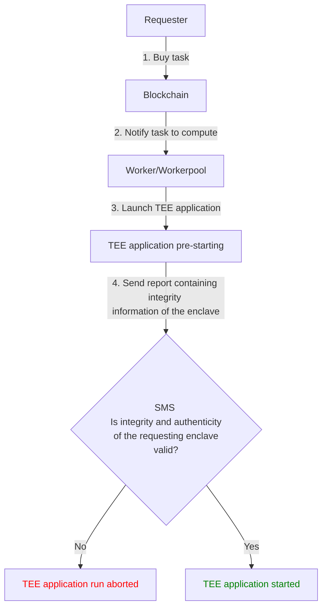

# Overview

**Confidential Computing** (or **Trusted Execution Environments -** **'TEE'**) ensures computation confidentiality through mechanisms of memory encryption at the hardware level. Applications being executed and data being processed are safeguarded against even the most privileged access levels (OS, Hypervisor...). Only authorized code can run inside this protected area and manipulate its data.

In some cases, ensuring that code runs correctly without any third party altering the execution, is even more important than hiding the computation's data. This concept is called **Trusted Computing.**

These guarantees are critical for a decentralized cloud where code is being executed on a remote machine, that is not controlled by the requester. They are also required to prevent leakage while monetizing data sets.

## Intel® Software Guard Extension (Intel® SGX)

[Intel® SGX](https://software.intel.com/en-us/sgx) is a technology that enables **Trusted Computing** and **Confidential Computing**. At its core, it relies on the creation of a special zone in the memory called an “enclave”. This enclave can be considered as a vault, to which only the CPU can have access. Neither privileged access-levels such as root, nor the operating system itself is capable of inspecting the content of this region. The code, as well as the data inside the protected zone, is totally unreadable and unalterable from the outside. This guarantees non-disclosure of data as well as tamper-proof execution of the code.

An application's code can be separated into "trusted" and "untrusted" parts where sensitive data is manipulated inside the protected area.

## Confidential Computing with iExec

Here is a general overview of how a TEE application runs on iExec:

To build such Confidential Computing (TEE) application, a developer would need to use the Intel® SGX SDK. With iExec, you don't need to manipulate it. Instead iExec supports high-level frameworks, known as TEE frameworks, such as Scone and Gramine. Further sections will cover in details these [TEE frameworks](choose-your-tee-framework.md).
