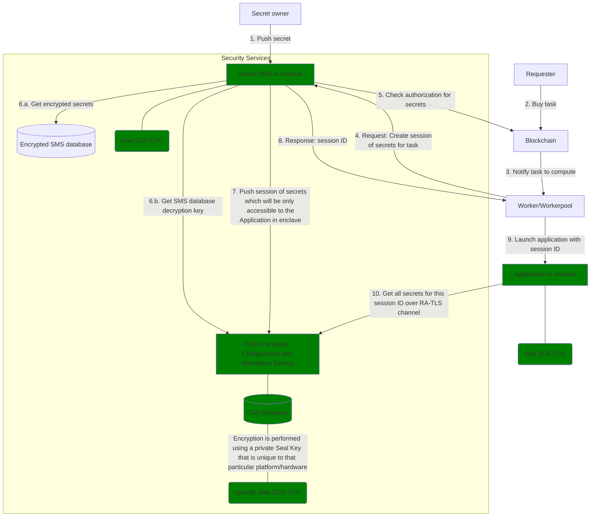

# Go to production

## Standard application

If you're developing a standard application, then you know everything needed to go to production! [Publish your orders](advanced/manage-your-apporders.md) with the price you think they are worth and here you go!

## Confidential Computing application

If you're developing a Confidential Computing application, then you'll need to be aware of important information. 

### Remote attestation
With the integration of TEE frameworks in iExec, you do not need to worry about [remote attestation](../help/glossary.md#remote-attestation). We do that for you, we guarantee that the code is running inside an enclave.

### The SMS is not meant to be a recovery storage


The following applies only to the Scone framework.


Let's talk about the [SMS](confidential-computing/access-confidential-assets.md). As we have seen before, this is a critical component. It holds all the secrets you give it, so nobody should be able to access its memory. That's why our production SMS runs inside an enclave.

The consequences are fairly easy to explain: if this enclave is lost, everything it contains is lost as well! To ensure security for your secrets, we have designed the SMS so nobody but the authorized applications can retrieve the secrets it holds - even we, iExec, the root-privilege user, can't retrieve the secrets we don't own. Please remember to keep your secrets locally in case the enclave is lost. Otherwise, nobody will be able to restore them.

As a reminder, a Scone enclave is protected by its application hash (AKA [MrEnclave](../help/glossary#mrenclave)) and the machine hardware.

If the application hash changes, then the old enclave memory becomes inaccessible for the new enclave. If the hardware changes, then the same applies. You've got it, if the SMS is updated, the secrets it holds are lost. If the SMS is migrated to another instance, the secrets it holds are lost. This may happen at any moment, with or without notice. So, be careful with your secrets and keep them locally.
