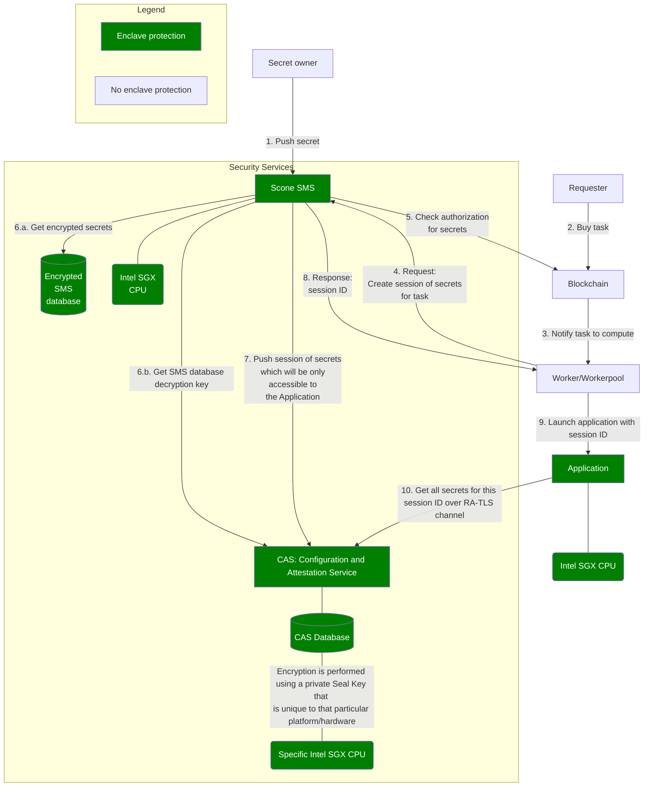

# Go to production


Before going any further, make sure you managed to:
- [Build your first application](your-first-app.md)
- [Build Confidential Computing app](confidential-computing/README.md)


## Connect to the production environment

To connect to the production environment, make sure your `chain.json` content is as follows:

```json
{
  "default": "bellecour",
  "chains": {
    "bellecour": {}
  }
}
```

## Standard application

If you are developing a standard application, then you are already set. To reach more audience, you can [publish your app to the Dapps store](#publish-your-app-to-the-dapps-store).

## Confidential Computing application


The following applies only to the Scone framework.


If you are developing a Confidential Computing application, be aware of following information.

### Sign your application

Any Confidential Computing application built previously on the [develop environment](confidential-computing/choose-your-tee-framework.md#lets-build) runs in a debug enclave, which, as warned, might be inspected.
To run your application in a production enclave, the application needs to be signed with a key compatible with the Intel® Attestation Service (IAS). Create this key in your [Intel developer Portal](https://api.portal.trustedservices.intel.com/).

When the key is created (`my-signer-key.pem`), update the previous [sconify.sh](confidential-computing/create-your-first-sgx-app.md#build-the-tee-docker-image) script by :
- sharing the folder containing the `my-signer-key.pem`, here `/signer`
- adding the `--scone-signer` option
```bash
docker run -it \
            -v /signer:/signer \
            [...]
            registry.scontain.com:5050/scone-production/iexec-sconify-image:<version> \
            sconify_iexec \
            --scone-signer=/signer/my-signer-key.pem \
            [...]
```

### Impacts of the SMS in enclave

As you have already learned in previous [confidential assets](confidential-computing/access-confidential-assets.md) section, the iExec SMS is a crucial component for TEE tasks on iExec, being in charge of:
- storing all secrets of iExec users (application developer, requester, dataset owner)
- defining - by following on-chain governance - which secrets are accessible to a specific enclave.

To reach a higher level of security on the production environment, the iExec SMS runs inside an enclave.

Below is a graph showing how the secrets and session mechanism works:


As seen in this diagram, required secrets are transferred to an authorized Application enclave over an RA-TLS channel ([Remote Attestation](https://www.intel.com/content/www/us/en/developer/tools/software-guard-extensions/attestation-services.html)).
Inside Security Services, all secrets are protected by an SMS database encryption key, itself backed by the CAS. The SMS enclave needs to prove its authenticity and integrity to the CAS in order to get access to its database encryption key.
To reach a higher level of security, the CAS enclave, which is the only component aware of the SMS database encryption key, is itself [sealed](https://www.intel.com/content/www/us/en/developer/articles/technical/introduction-to-intel-sgx-sealing.html) to a specific platform enclave.
With that pattern, no one, even an administrator or someone with root privileges, can inspect confidential assets of users.

#### CAS update and failure

While giving high guarantees about confidentiality of the data, if the CAS software is updated, or if the hardware under the CAS is updated or falls out of order, the CAS data will not be recoverable, hence user secrets will be lost.

#### SMS update

In addition, when deploying a new configuration or software release for the SMS, the application enclave hash (MREnclave) will change. For that reason, old SMS data enclave will not be accessible to the new one, hence user secrets will be lost.

#### Backup your secrets


For these reasons, secrets can be lost at any time, with or without notice. Always keep a local copy of your secrets. Nobody, even iExec, will be able to restore them.



## Publish your app to the Dapps store

To get more visibility for your application, make your application available on the [Dapps store](https://dapps.iex.ec/). To get there, follow instructions inside the [iexec-dapps-registry](https://github.com/iExecBlockchainComputing/iexec-dapps-registry) repository. For any trouble, contact the [iExec Help Center](https://iexecproject.atlassian.net/servicedesk/customer/portal/4).
