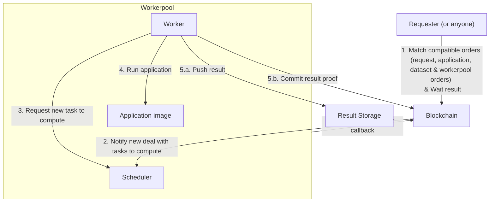

# Quick Start



**Prerequisite:**

- [Nodejs](https://nodejs.org) 14.17.1 or higher



iExec enables decentralized docker app deployment and monetization on the blockchain.

In this guide, we will use the iExec SDK command-line interface to deploy an iExec app on a test blockchain.

**Tutorial Steps :**

- [Create your identity on the blockchain](quick-start-for-developers.md#create-your-identity-on-the-blockchain)
- [Initialize your iExec project](quick-start-for-developers.md#initialize-your-iexec-project)
- [Deploy your app on iExec](quick-start-for-developers.md#deploy-your-app-on-iexec)
- [Run your app on iExec](quick-start-for-developers.md#run-your-app-on-iexec)
- [Publish your app on iExec marketplace](quick-start-for-developers.md#publish-your-app-on-the-iexec-marketplace)
- [What's next?](quick-start-for-developers.md#whats-next)

## Create your identity on the blockchain

On the blockchain, your identity is defined by your **wallet,** constisting of cryptochraphically encrypted **private key** and **public address.** What you own on the blockchain is associated with your address. The applications you deploy on iExec are associated with your wallet.

Let's set up your wallet.

Install the iExec SDK cli \(requires [Nodejs](https://nodejs.org)\)

```text
npm i -g iexec        # sudo <cmd> if needed
```

Create a new Wallet file

```text
iexec wallet create
```

You will be asked to choose a password to protect your wallet, don't forget it since there is no way to recover it. The SDK creates a wallet file that contains a randomly generated private key encrypted by the chosen password and the derived public address. Make sure to back up the wallet file in a safe place and write down your address.



Your wallet is stored in the ethereum keystore, the location depends on your OS:

- On Linux: ~/.ethereum/keystore
- On Mac : ~/Library/Ethereum/keystore
- On Windows: ~/AppData/Roaming/Ethereum/keystore

Wallet file name follow the pattern `UTC--<CREATION_DATE>--<ADDRESS>`





iExec SDK uses standard Ethereum wallet, you can reuse or import existing Ethereum wallet. See iExec SDK documentation [wallet command](https://github.com/iExecBlockchainComputing/iexec-sdk/blob/v8.1.5/CLI.md#iexec-wallet).



## Initialize your iExec project

Create a new folder for your iExec project and initialize the project:

```text
mkdir ~/iexec-projects
cd ~/iexec-projects
iexec init --skip-wallet
```



The iExec SDK creates the minimum configuration files:

- `iexec.json` contains the project configuration
- `chain.json` contains the blockchain connection configuration
- we use `--skip-wallet` to skip wallet creation as we already created it



You can now connect to the blockchain. In the following steps, we will use the [iExec sidechain (also called Bellecour)](sidechain/overview.md).

You can now check your wallet content:

```text
iexec wallet show --chain bellecour
```

### Initialize your remote storage

iExec enables running apps producing output files, you will need a place for storing your apps outputs.

Initialize your default remote storage:

```text
iexec storage init --chain bellecour
```



iExec provides a default storage solution based on [IPFS](https://ipfs.io/). This solution ensures your result to be publicly accessible through a decentralized network.

As you may not want all your business to be exposed to the world, iExec enables both optional **RSA result encryption** and pushing results to **private storage providers**.



## Deploy your app on iExec

iExec enables decentralized deployment of dockerized applications. The applications deployed on iExec are Smart Contracts identified by their Ethereum address and referencing a public docker image. Each iExec application has an owner who can set the execution permissions on iExec platform.

Let's deploy an iExec app!

Initialize a new application

```text
iexec app init
```

The iExec SDK writes the minimum app configuration in `iexec.json`

| **key** | **description** |
| --- | --- |
| owner | app owner ethereum address \(default your wallet address\) |
| name | name of the application |
| type | type of application \("DOCKER" for docker container\) |
| multiaddr | download URI of the application \(a public docker registry\) |
| checksum | checksum of the app \("0x" + docker image digest\) |
| mrenclave | app fingerprint used for confidential computing use cases \(default empty\) |



The default app is the public docker image [iexechub/python-hello-world](https://hub.docker.com/repository/docker/iexechub/python-hello-world).

Given an input string, the application generates an ASCII art greeting. 

You can deploy this application on iExec, it will run out of the box. When you are confident with iExec concept, you can read [Your first app](your-first-app.md) and learn how to setup your own app on iExec.

You will now deploy your app on iExec, this will be your first transaction on the blockchain:

```text
iexec app deploy --chain bellecour
```



While running `iexec app deploy --chain bellecour` you sent your first transaction on the bellecour blockchain.



You can check your deployed apps with their index, let's check your last deployed app:

```text
iexec app show --chain bellecour
```

## Run your app on iExec

iExec allows you to run applications on a decentralized infrastructure with payment in **RLC** tokens \(the native cryptocurrency of iExec\).



To run an application you must have enough RLC staked on your iExec account to pay for the computing resources.

Your iExec account is managed by smart contracts \(and not owned by iExec\).

When you request an execution the price for the task is locked from your account's stake then transferred to accounts of the workers contributing to the task \(read more about [Proof of Contribution](../key-concepts/proof-of-contribution.md) protocol\).

At any time you can:

- view your balance

```sh
iexec account show
```

- deposit RLC from your wallet to your iExec Account

```sh
iexec account deposit <amount>
```

- withdraw RLC from your iExec account to your wallet \(only stake can be withdrawn\)

```sh
iexec account withdraw <amount>
```



Currently, iExec sponsors applications running on Bellecour, and you won't have to pay for the computation.

Everything is ready to run your application!

```text
iexec app run --args <your-name-here> --watch --chain bellecour
```



`iexec app run` allows to run an application on iExec at the market price.

Useful options:

- `--args <args>` specify the app execution arguments
- `--watch` watch execution status changes
- `--workerpool <address>` specify the workerpool to use (eg: `--workerpool debug-v8-bellecour.main.pools.iexec.eth`)

Discover more option with `iexec app run --help`





Congratulation you requested the execution of [iexechub/python-hello-world](https://hub.docker.com/repository/docker/iexechub/python-hello-world).

This will generate an ASCII art greeting with your name.



The execution of tasks on the iExec network is asynchronous by design.



Guaranties about completion times (fast/slow) are available in the [category section](../key-concepts/pay-per-task-model.md):

- maximum deal/task time
- maximum computing time

Once the task is completed copy the taskid from `iexec app run` output \(taskid is a 32Bytes hexadecimal string\).

Download the result of your task

```text
iexec task show <taskid> --download my-result --chain bellecour
```

You can get your taskid with the command:

```text
iexec deal show <dealid>
```



A task result is a zip file containing the output files of the application.



[iexechub/python-hello-world](https://hub.docker.com/repository/docker/iexechub/python-hello-world) produce an text file in `result.txt`.

Let's discover the result of the computation.

```text
unzip my-result.zip -d my-result
cat my-result/result.txt
```

Congratulations! You successfully executed your application on iExec!

## Publish your app on the iExec Marketplace

Your application is deployed on iExec and you completed an execution on iExec. For now, only you can request an execution of your application. The next step is to publish it on the iExec Marketplace, making it available for anyone to use.

As the owner of this application, you can define the conditions under which it can be used



iExec uses orders signed by the resource owner's wallet to ensure resources governance.

The conditions to use an app are defined in the **apporder**.



Publish a new apporder for your application.

```text
iexec app publish --chain bellecour
```



`iexec app publish` options allows to define custom access rules to the app \(run `iexec app publish --help` to discover all the possibilities\).

You will learn more about orders management later, keep the apporder default values for now.



Your application is now available for everyone on iExec marketplace on the conditions defined in apporder.

You can check the published apporders for your app

```text
iexec orderbook app <your app address> --chain bellecour
```

Congratulation you just created a decentralized application! Anyone can now trigger an execution of your application on the iExec decentralized infrastructure.

- With the iexec SDK CLI `iexec app run <app address> --chain bellecour --workerpool debug-v8-bellecour.main.pools.iexec.eth`
- On iExec marketplace

## What's next?

You are now familiar with the following key iExec concepts for developers:

- Your wallet is your on-chain ID and blockchain account
- You can deploy decentralized applications on iExec
- Anyone can run tasks against payment in RLC on iExec
- Payments are processed by the decentralized platform between users' iExec Accounts
- Resource governance is managed by orders

Continue with these guides:

- [Learn how to build your first application running on iExec](your-first-app.md)
- [Learn how to manage your apporders](advanced/manage-your-apporders.md)
