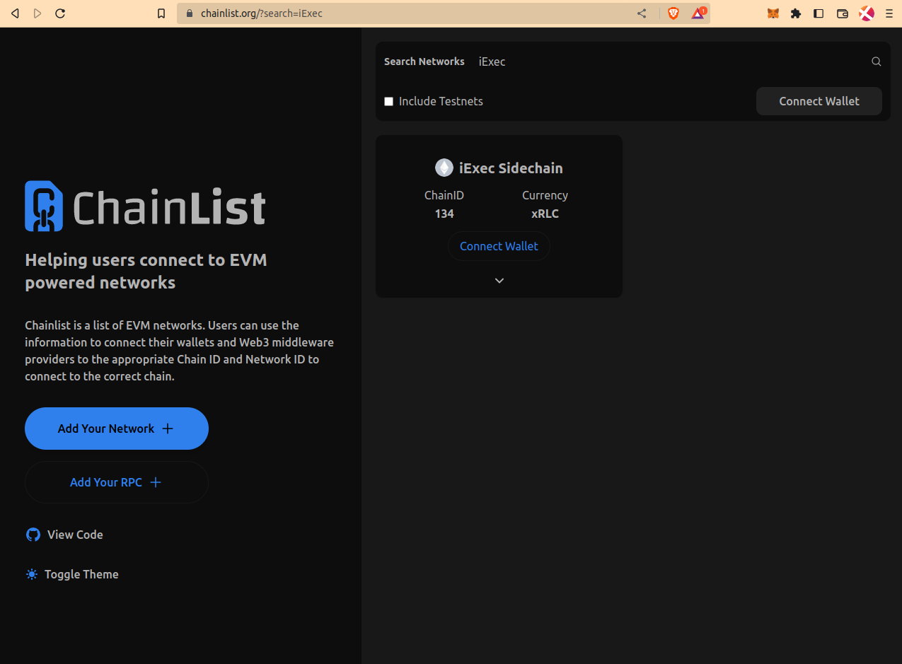
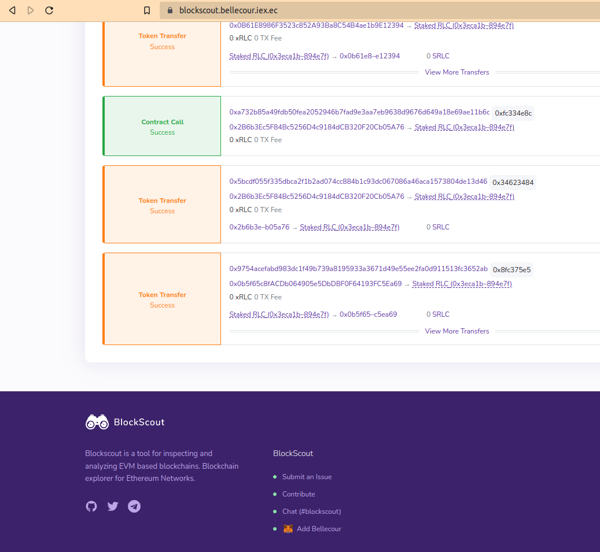
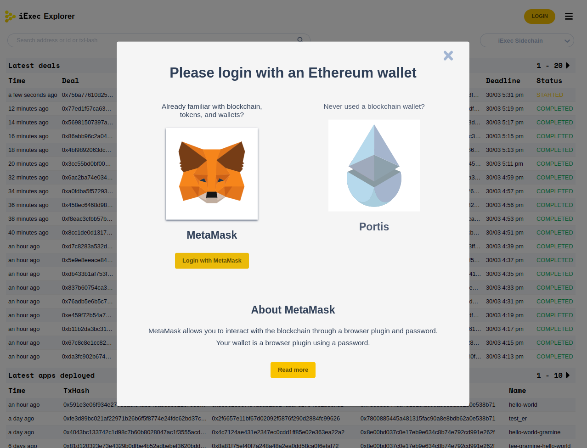
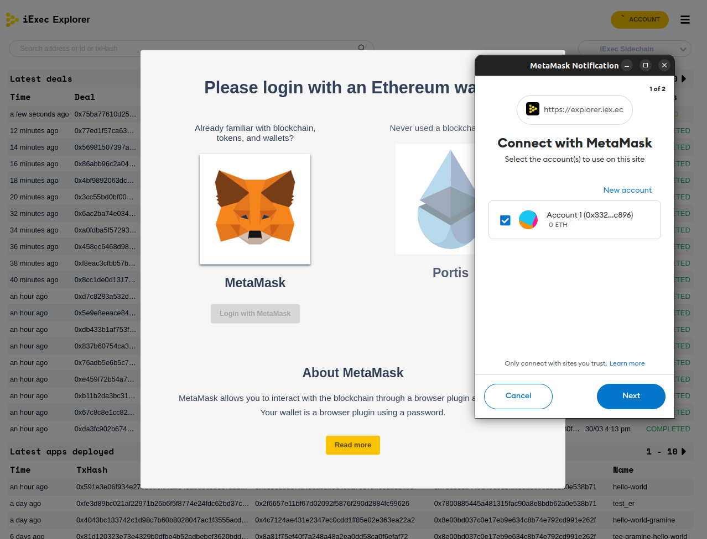
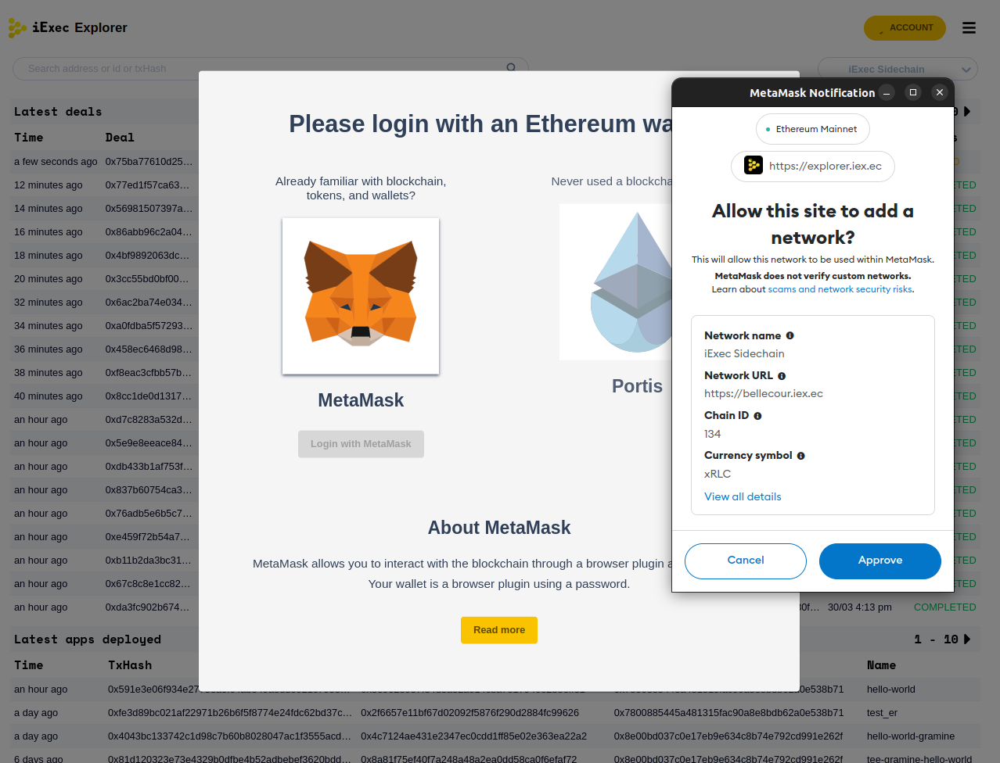
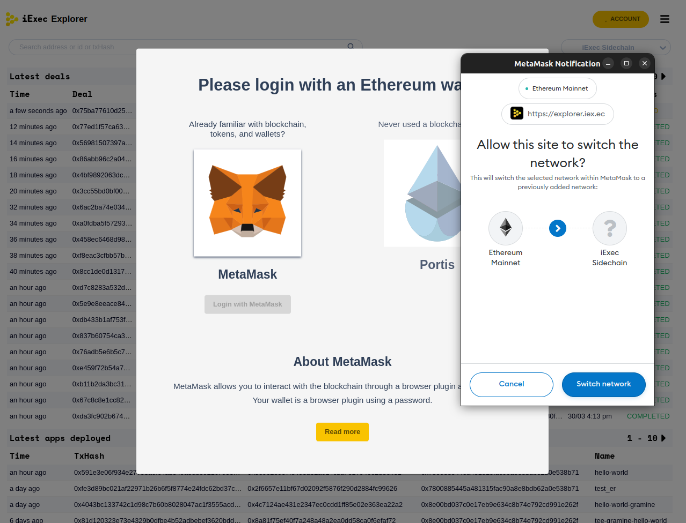
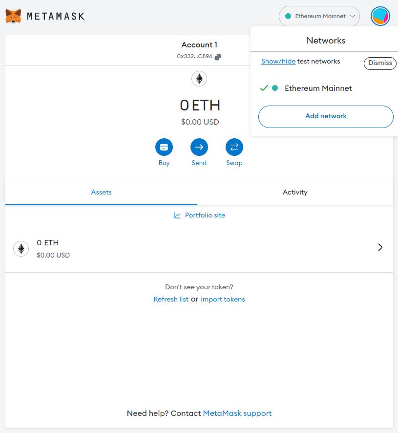
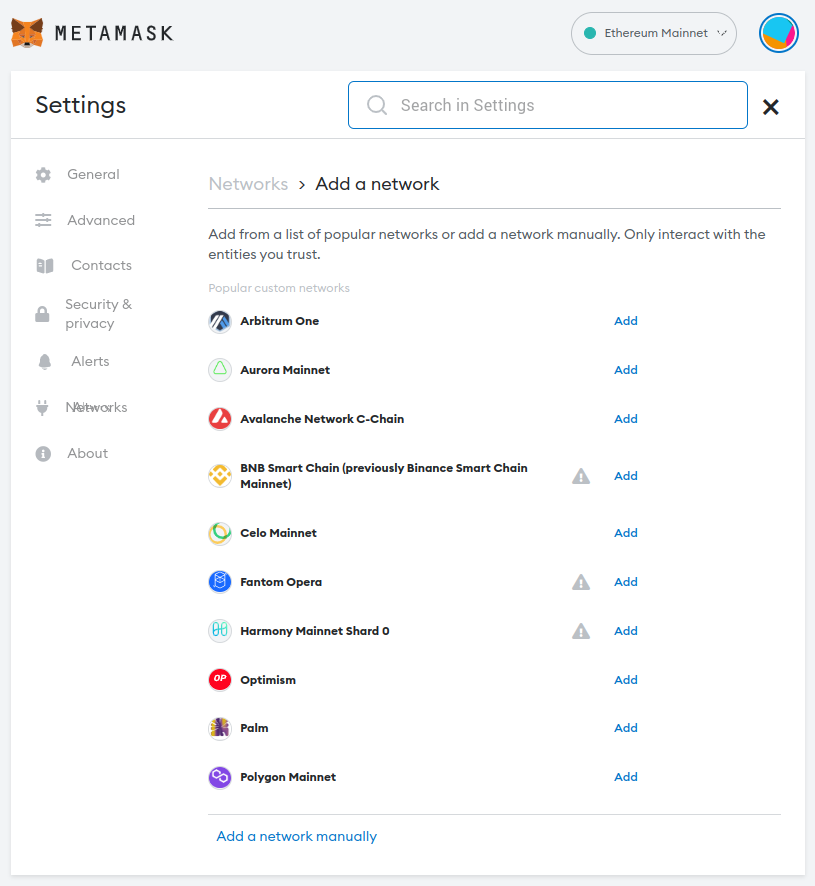
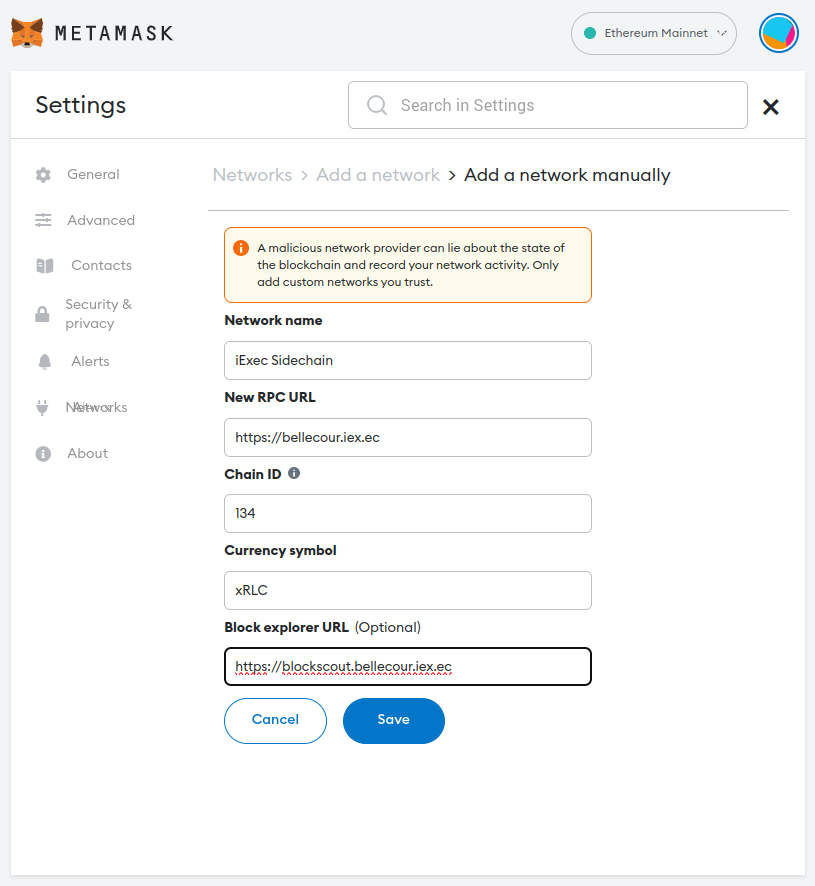

# Connect to iExec Sidechain

As mentioned in the [Overview](for-developers/sidechain/overview.md) section, iExec Sidechain is EVM-compatible meaning that users can connect to Bellecour with their existing EVM-compatible wallets (e.g. Metamask, Portis, ...etc).  
The following instructions explain how to connect to iExec Sidechain.

## Option 1 - Chainlist
iExec Sidechain is listed on [https://chainlist.org](https://chainlist.org/?search=iExec) so users can add it to their wallets easily from there.

## Option 2 - Blockscout
iExec Sidechain could also be added to wallets directly from its explorer <https://blockscout.bellecour.iex.ec>.

## Option 3 - iExec account manager
iExec account manager used across iExec products, when used for the first time, allows users to add iExec Sidechain to the network list of their wallet.

## Option 4 - Manually on Metamask

Open Metamask and click on **Add network**

Select **Add a network manually**

Enter the following chain details and click on **Save**:
* Network name: iExec Sidechain
* New RPC URL: https://bellecour.iex.ec
* Chain ID: 134
* Currency symbol: xRLC
* Block explorer URL: https://blockscout.bellecour.iex.ec

