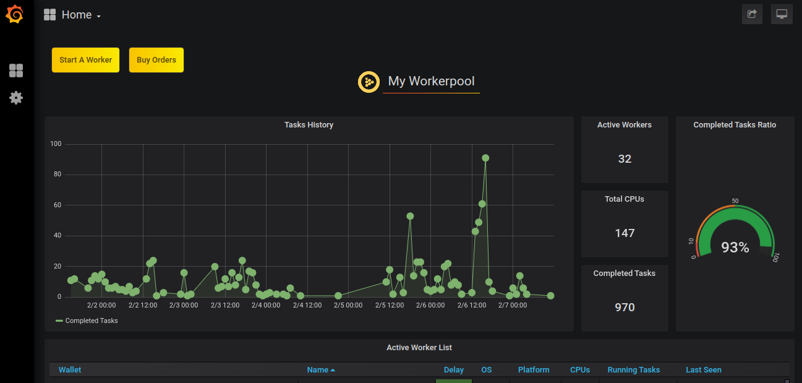

# Manage a workerpool

An iExec workerpool is orchestrated by an _iExec Core Scheduler_. The _iExec Core Scheduler_ watches on-chain deals and schedules off-chain computation among available workers.

## Deploy a workerpool

You can deploy your own workerpool on iExec with [this repository](https://github.com/iExecBlockchainComputing/deploy-workerpool). Be sure to check a particular [release](https://github.com/iExecBlockchainComputing/deploy-workerpool/releases) before starting your deployment.
