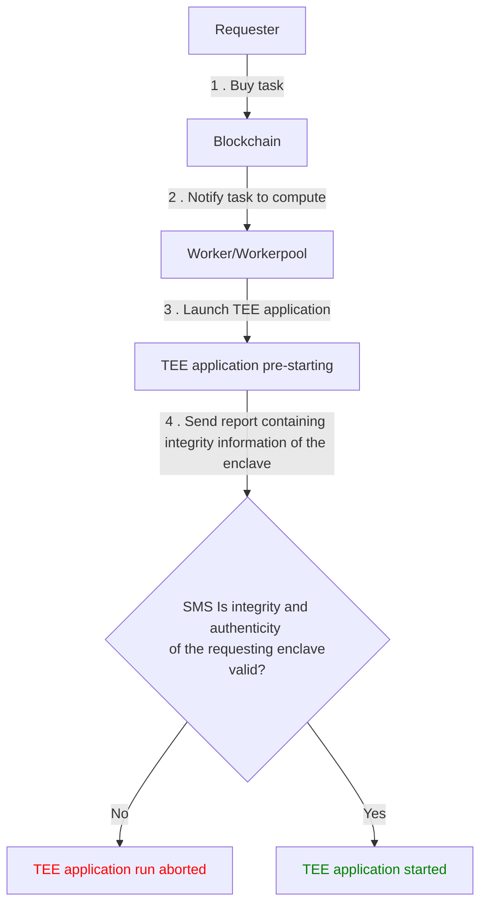

# Overview

**Confidential Computing** (or **Trusted Execution Environments -** **'TEE'**)
ensures computation confidentiality through mechanisms of memory encryption at
the hardware level. Applications being executed and data being processed are
safeguarded against even the most privileged access levels (OS, Hypervisor...).
Only authorized code can run inside this protected area and manipulate its data.

In some cases, ensuring that code runs correctly without any third party
altering the execution, is even more important than hiding the computation's
data. This concept is called **Trusted Computing.**

These guarantees are critical for a decentralized cloud where code is being
executed on a remote machine, that is not controlled by the requester. They are
also required to prevent leakage while monetizing data sets.

## Intel® Software Guard Extension (Intel® SGX)

[Intel® SGX](https://software.intel.com/en-us/sgx) is a technology that enables
**Trusted Computing** and **Confidential Computing**. At its core, it relies on
the creation of a special zone in the memory called an “enclave”. This enclave
can be considered as a vault, to which only the CPU can have access. Neither
privileged access-levels such as root, nor the operating system itself is
capable of inspecting the content of this region. The code, as well as the data
inside the protected zone, is totally unreadable and unalterable from the
outside. This guarantees non-disclosure of data as well as tamper-proof
execution of the code.

An application's code can be separated into "trusted" and "untrusted" parts
where sensitive data is manipulated inside the protected area.

## Confidential Computing with iExec

Here is a general overview of how a TEE application runs on iExec:

To build such Confidential Computing (TEE) application, a developer would need
to use the Intel® SGX SDK. With iExec, you don't need to manipulate it. Instead
iExec supports the high-level Scone framework.

At a high-level, Scone protects the confidentiality and integrity of the data
and the code without needing to modify or recompile the application. With native
Intel® SGX technology, the OS is not a part of the Trusted Computing Base (TCB)
hence system calls and kernel services are not available from an Intel® SGX
enclave. This can be limiting as the application will not be able to use File
System and sockets directly from the code running inside the enclave. The
[Scone](https://scontain.com/) framework resolves this and reduces the burden of
porting the application to Intel® SGX.

More precisely, Scone provides a C standard library interface to container
processes. System calls are executed outside of the enclave, but they are
shielded by transparently encrypting/decrypting application data. Files stored
outside of the enclave are therefore encrypted, and network communication is
protected by Transport Layer Security (TLS).

For a deeper understanding, you can have a look to the official
[Scone documentation](https://sconedocs.github.io/).

## Let's build

::: warning

Following steps will show you how to build a Confidential Computing application.
The environment you are about to use is a "develop" environment:

- which can be reset at any time
- where configurations and secrets might be inspected (debug enclaves)

When your developer discovery journey is complete, please reach the
[production section](/guides/build-iapp/build-&-deploy#go-to-production).

:::
