# 🛡️ Intel TDX Technology

**Intel TDX (Trust Domain Extensions)** is Intel's next-generation confidential
computing technology, representing the evolution from application-level to
virtual machine-level protection. On the iExec platform, TDX is an
**experimental technology** that offers advanced capabilities for
memory-intensive workloads and legacy application migration.

## What is Intel TDX?

**TDX (Trust Domain Extensions)** is Intel's newer confidential computing
technology that provides VM-level protection, allowing entire virtual machines
to run in secure, isolated environments.

### Key TDX Benefits

1. **🔄 Lift-and-Shift Compatibility**: Run existing applications with minimal
   changes
2. **💾 Large Memory Support**: Handle memory-intensive workloads (AI,
   databases)
3. **🛡️ VM-Level Protection**: Protect entire virtual machines, not just
   applications
4. **⚡ Better Performance**: Optimized for complex workloads

## TDX: The "Virtual Machine-Level" Security

**Intel TDX** is like having an **entire secure building** where you can move
your existing operations without major renovations. It protects entire virtual
machines.

### Key Characteristics

- **Scope**: Protects entire virtual machines
- **Memory**: Large secure memory space (like a large vault)
- **Code Changes**: Minimal changes needed - "lift and shift" approach
- **Use Case**: Ideal for complex applications, legacy systems, and AI workloads

**Analogy**: TDX is like moving your entire office into a secure building where
everything is protected.

### Visual Representation

```mermaid
graph TB
    Hypervisor[Hypervisor<br/>Cannot see inside TDX]
    TrustDomain[🔒 TDX Trust Domain<br/>Entire VM Protected]
    App[Your Complete Application<br/>All Protected]
    Data[OS, Libraries, Data<br/>All Encrypted]
    Hypervisor --> TrustDomain
    TrustDomain --> App
    App --> Data
    style TrustDomain fill:#ffffff,stroke:#0000ff,stroke-width:2px,color:#000000
    style Data fill:#ffffff,stroke:#00ff00,stroke-width:2px,color:#000000
```

## TDX Technology Details

### How TDX Works

1. **Trust Domain Creation**: TDX creates secure virtual machines called "trust
   domains"
2. **VM-Level Isolation**: Entire virtual machines run in isolated, secure
   environments
3. **Large Memory Support**: Significantly larger secure memory space compared
   to SGX
4. **Legacy Compatibility**: Existing applications can run with minimal
   modifications

### TDX Advantages

- **Larger Memory**: Multi-GB+ secure memory space vs limited SGX memory
- **Easier Migration**: "Lift and shift" approach for existing applications
- **Better Performance**: Optimized for complex, memory-intensive workloads
- **VM-Level Security**: Protects entire virtual machines, not just applications

## TDX with iExec

iExec is actively exploring TDX technology to expand the platform's capabilities
and prepare for the future of confidential computing.

### iExec's TDX Infrastructure

iExec provides experimental TDX support through:

- **🔬 Experimental Worker Pools**: Limited TDX-enabled workers for testing
- **📦 TDX Technology Support**: Integration with Intel TDX technology
- **🔐 Secret Management Service**: SMS support for TDX applications
- **📋 Task Verification**: Proof of contribution for TDX executions
- **🔗 Blockchain Integration**: Decentralized coordination and payment

### iExec TDX Workflow

## When to Use TDX

**TDX is ideal for**:

- 💾 Working with memory-intensive applications
- 🔄 Running existing applications with minimal changes
- 🚀 Running complex workloads with VM-level protection

## What's Next?

**Learn about the foundation**:

- **[Intel SGX Technology](/get-started/protocol/tee/intel-sgx)** -
  First-generation application-level TEE technology
- **[SGX vs TDX Comparison](/get-started/protocol/tee/sgx-vs-tdx)** - Detailed
  comparison of both technologies

**Ready to experiment with TDX?** Check out the practical guides:

- **[Build Intel TDX App (Experimental)](/guides/build-iapp/advanced/create-your-first-tdx-app)** -
  Build TDX applications with traditional deployment and iApp Generator
- **[Create Your First TDX App](/guides/build-iapp/advanced/create-your-first-tdx-app)** -
  Build TDX applications

**For production applications, use SGX**:

- **[Build & Deploy](/guides/build-iapp/build-&-deploy)** - Create
  production-ready SGX applications
