# 🛡️ Introduction to TEE Technologies

**Trusted Execution Environments (TEE)** are the foundation of confidential
computing, providing hardware-level security for sensitive applications and data
processing. On the iExec platform, TEE technologies enable secure,
privacy-preserving computation in a decentralized environment.

## What is Confidential Computing?

**Confidential Computing** (or **Trusted Execution Environments - TEE**) ensures
computation confidentiality through mechanisms of memory encryption at the
hardware level. Applications being executed and data being processed are
safeguarded against even the most privileged access levels (OS, Hypervisor...).
Only authorized code can run inside this protected area and manipulate its data.

In some cases, ensuring that code runs correctly without any third party
altering the execution, is even more important than hiding the computation's
data. This concept is called **Trusted Computing.**

These guarantees are critical for a decentralized cloud where code is being
executed on a remote machine, that is not controlled by the requester. They are
also required to prevent leakage while monetizing data sets.

## Why TEE Matters for iExec

iExec is a decentralized cloud computing platform that enables secure,
privacy-preserving computation. TEE technologies are essential to iExec's
mission because:

### 🔒 **Decentralized Trust**

- **Problem**: In a decentralized network, you can't trust individual workers
- **Solution**: TEE provides hardware-level guarantees regardless of who owns
  the hardware
- **iExec Benefit**: Users can trust computation results even from unknown
  workers

### 💰 **Data Monetization**

- **Problem**: Data owners can't safely share their data for computation
- **Solution**: TEE ensures data remains encrypted and private during processing
- **iExec Benefit**: Data providers can monetize their data without losing
  control

### 🌐 **Global Computation**

- **Problem**: Sensitive applications can't run on untrusted infrastructure
- **Solution**: TEE creates secure environments anywhere in the world
- **iExec Benefit**: Applications can run globally while maintaining security

## Understanding TEE: The Foundation

Before diving into specific technologies, let's understand what TEE is and why
it matters.

### What is TEE (Trusted Execution Environment)?

Think of a **TEE** as a **secure vault inside your computer** where sensitive
operations happen. It's like having a private room that only authorized code can
enter, and once inside, everything is protected from the outside world - even
from the operating system itself.

**Real-world analogy**: Imagine a bank vault inside a regular building. The
building (your computer) can be accessed by many people, but the vault (TEE) has
special security measures that keep its contents completely private and secure.

### Why TEE Matters

**Traditional Computing Problems**:

- 🔍 **Data Exposure**: Your data is visible to the operating system and other
  applications
- 🛡️ **No Trust**: You can't trust remote computers to keep your data private
- 🔓 **Vulnerable**: Malicious software or compromised systems can access your
  data

**TEE Solutions**:

- 🔒 **Data Privacy**: Your data is encrypted and protected during processing
- 🛡️ **Hardware Security**: Special CPU features ensure data stays private
- 🌐 **Trust Anywhere**: Run securely on computers you don't control

### TEE vs Regular Computing

| **Regular Computing**           | **TEE Computing**                      |
| ------------------------------- | -------------------------------------- |
| Code and data visible to OS     | Code and data encrypted and hidden     |
| Vulnerable to system attacks    | Protected even from privileged access  |
| No hardware security guarantees | Hardware-level security protection     |
| Like working in a public space  | Like working in a secure, private room |

### Visual Representation

**Regular Computing:**

**TEE Computing:**

```mermaid
graph TB
    OS2[Operating System<br/>Cannot see inside TEE]
    App2[Regular Application Parts]
    TEE[🔒 TEE Enclave<br/>Protected]
    Data2[Sensitive Code & Data<br/>Encrypted]

    OS2 --> App2
    App2 --> TEE
    TEE --> Data2

    style TEE fill:#ffffff,stroke:#0000ff,stroke-width:2px,color:#000000
    style Data2 fill:#ffffff,stroke:#00ff00,stroke-width:2px,color:#000000
    style OS2 fill:#ffffff,stroke:#000000,stroke-width:1px,color:#000000
    style App2 fill:#ffffff,stroke:#000000,stroke-width:1px,color:#000000
```

## How TEE Works

### Core Principles

1. **Hardware Protection**: Special CPU features create isolated, secure areas
2. **Memory Encryption**: All data in the secure area is automatically encrypted
3. **Access Control**: Only authorized code can enter the secure area
4. **Integrity Verification**: The system can prove it's running the correct
   code

### iExec's TEE Infrastructure

iExec provides a complete TEE infrastructure that includes:

- **🔐 Secret Management Service (SMS)**: Secure storage for encryption keys and
  secrets
- **🛡️ TEE Workers**: Computing nodes with TEE hardware support
- **📋 Task Verification**: Proof of contribution system that verifies TEE
  execution
- **🔗 Blockchain Integration**: Decentralized coordination and payment

## TEE Technology Evolution

TEE technologies have evolved to address different use cases and requirements:

### First Generation: Application-Level Protection

- **Focus**: Protecting specific parts of applications
- **Memory**: Limited secure memory
- **Use Cases**: Focused, lightweight applications
- **Examples**: Intel SGX
- **iExec Support**: ✅ Production-ready with Scone framework

### Second Generation: Virtual Machine-Level Protection

- **Focus**: Protecting entire virtual machines
- **Memory**: Large secure memory space
- **Use Cases**: Complex applications, legacy systems, AI workloads
- **Examples**: Intel TDX
- **iExec Support**: 🔬 Experimental with limited availability

## iExec TEE Use Cases

### 🔐 **Protected Data Processing**

- **Scenario**: Process sensitive data without exposing it
- **TEE Role**: Data remains encrypted during computation
- **iExec Benefit**: Data owners maintain control while enabling computation

### 🤖 **AI Model Training**

- **Scenario**: Train AI models on private datasets
- **TEE Role**: Model training happens in secure enclaves
- **iExec Benefit**: Collaborative AI without data sharing

### 💳 **Financial Applications**

- **Scenario**: Process financial data securely
- **TEE Role**: Sensitive calculations in protected environments
- **iExec Benefit**: DeFi applications with privacy guarantees

### 🏥 **Healthcare Analytics**

- **Scenario**: Analyze medical data while preserving privacy
- **TEE Role**: Patient data never leaves secure enclaves
- **iExec Benefit**: Medical research without privacy risks

## What's Next?

**Learn about specific TEE technologies**:

- **[Intel SGX Technology](/get-started/protocol/tee/intel-sgx)** -
  First-generation application-level TEE
- **[Intel TDX Technology](/get-started/protocol/tee/intel-tdx)** -
  Next-generation VM-level TEE
- **[SGX vs TDX Comparison](/get-started/protocol/tee/sgx-vs-tdx)** -
  Side-by-side technology comparison

**Ready to build with TEE?** Check out the practical guides:

- **[Build Intel TDX App (Experimental)](/guides/build-iapp/advanced/create-your-first-tdx-app)** -
  Build TDX applications with traditional deployment and iApp Generator
- **[Build & Deploy](/guides/build-iapp/build-&-deploy)** - Create your first
  TEE application
