# 🛡️ Introduction to TEE Technologies

**Trusted Execution Environments (TEE)** are the foundation of confidential
computing, providing hardware-level security for sensitive applications and data
processing. On the iExec platform, TEE technologies enable secure,
privacy-preserving computation in a decentralized environment.

## What is Confidential Computing?

**Confidential Computing** ensures that your data and code are protected even
when running on computers you don't control. Think of it as having a secure
vault inside any computer where your sensitive operations happen privately.

**Key Benefits:**

- 🔒 **Data Privacy**: Your data stays encrypted and private during processing
- 🛡️ **Hardware Security**: Special CPU features keep your data safe
- 🌐 **Trust Anywhere**: Run securely on remote computers

## Understanding TEE: The Foundation

### What is TEE (Trusted Execution Environment)?

Think of a **TEE** as a **secure vault inside your computer** where sensitive
operations happen. It's like having a private room that only authorized code can
enter, and once inside, everything is protected from the outside world.

**Real-world analogy**: Imagine a bank vault inside a regular building. The
building (your computer) can be accessed by many people, but the vault (TEE) has
special security measures that keep its contents completely private and secure.

### TEE vs Regular Computing

| **Regular Computing**           | **TEE Computing**                      |
| ------------------------------- | -------------------------------------- |
| Code and data visible to OS     | Code and data encrypted and hidden     |
| Vulnerable to system attacks    | Protected even from privileged access  |
| No hardware security guarantees | Hardware-level security protection     |
| Like working in a public space  | Like working in a secure, private room |

### Visual Representation

**Regular Computing:**

**TEE Computing:**

```mermaid
graph TB
    OS2[Operating System<br/>Cannot see inside TEE]
    App2[Regular Application Parts]
    TEE[🔒 TEE Enclave<br/>Protected]
    Data2[Sensitive Code & Data<br/>Encrypted]

    OS2 --> App2
    App2 --> TEE
    TEE --> Data2

    style TEE fill:#ffffff,stroke:#0000ff,stroke-width:2px,color:#000000
    style Data2 fill:#ffffff,stroke:#00ff00,stroke-width:2px,color:#000000
    style OS2 fill:#ffffff,stroke:#000000,stroke-width:1px,color:#000000
    style App2 fill:#ffffff,stroke:#000000,stroke-width:1px,color:#000000
```

## How TEE Works

### Core Principles

1. **Hardware Protection**: Special CPU features create isolated, secure areas
2. **Memory Encryption**: All data in the secure area is automatically encrypted
3. **Access Control**: Only authorized code can enter the secure area
4. **Integrity Verification**: The system can prove it's running the correct
   code

## TEE Technology Evolution

TEE technologies have evolved to address different use cases:

### First Generation: Application-Level Protection (Intel SGX)

- **Focus**: Protecting specific parts of applications
- **Memory**: Limited secure memory
- **Use Cases**: Lightweight applications
- **iExec Support**: ✅ Production-ready

### Second Generation: Virtual Machine-Level Protection (Intel TDX)

- **Focus**: Protecting entire virtual machines
- **Memory**: Large secure memory space
- **Use Cases**: Complex applications, AI workloads
- **iExec Support**: 🔬 Experimental

## What's Next?

**Learn about specific TEE technologies**:

- **[Intel SGX Technology](/get-started/protocol/tee/intel-sgx)** -
  First-generation application-level TEE
- **[Intel TDX Technology](/get-started/protocol/tee/intel-tdx)** -
  Next-generation VM-level TEE
- **[SGX vs TDX Comparison](/get-started/protocol/tee/sgx-vs-tdx)** -
  Side-by-side technology comparison

**Ready to build with TEE?** Check out the practical guides:

- **[Build Intel TDX App (Experimental)](/guides/build-iapp/advanced/create-your-first-tdx-app)** -
  Build TDX applications with traditional deployment and iApp Generator
- **[Deploy & Run](/guides/build-iapp/deploy-&-run)** - Create your first
  TEE application
