# 🛡️ SGX vs TDX: Technology Comparison

**Intel SGX and Intel TDX are both TEE technologies, but they solve the security
problem differently.** On the iExec platform, SGX is the **production-ready,
widely-supported technology**, while TDX is the **experimental, next-generation
technology** for advanced use cases. This guide provides a comprehensive
comparison to help you choose the right technology for your iExec applications.

## Why This Comparison Matters for iExec

iExec supports both SGX and TDX technologies to provide developers with the
right tools for different use cases:

### 🔒 **Platform Strategy**

- **SGX**: Current production technology for reliable, secure applications
- **TDX**: Future technology for advanced, memory-intensive workloads
- **Dual Support**: iExec maintains both to serve different developer needs

### 💰 **Use Case Optimization**

- **SGX**: Optimized for lightweight applications
- **TDX**: Optimized for complex applications
- **Choice**: Developers can select the best technology for their specific needs

### 🌐 **Network Evolution**

- **Current**: SGX workers provide wide availability and reliability
- **Future**: TDX workers will enable advanced use cases
- **Transition**: iExec is preparing for the next generation of TEE technology

## Quick Overview

| Aspect                  | Intel SGX                       | Intel TDX                 |
| ----------------------- | ------------------------------- | ------------------------- |
| **Release Year**        | 2015                            | 2023                      |
| **Protection Scope**    | Application level               | Trusted domain level      |
| **Memory Size**         | Limited                         | Extensive (multi-GB+)     |
| **Code Changes**        | ❌ Significant changes required | ✅ Minimal changes needed |
| **iExec Status**        | ✅ Production ready             | 🔬 Experimental           |
| **Worker Availability** | ✅ Widely supported             | ❌ Limited availability   |
| **iExec Use Cases**     | Lightweight applications        | Complex workloads         |
| **Platform Support**    | Full iExec ecosystem            | Experimental workerpools  |

## Detailed Comparison

### 🎯 **Protection Scope**

#### Intel SGX: Application-Level Protection

- **What it protects**: Individual applications or parts of applications
- **Scope**: Small, focused secure areas within larger applications
- **Analogy**: Like installing a small, specialized safe inside your office

#### Intel TDX: Trusted Domain Protection

- **What it protects**: Trusted domains (secure virtual machines)
- **Scope**: Multiple trusted domains can run on a single TDX machine
- **Analogy**: Like having multiple secure offices within one secure building

### 💾 **Memory and Performance**

#### Intel SGX

- **Memory**: Limited secure memory (typically 1-2GB)
- **Performance**: Optimized for lightweight applications
- **Limitations**: Memory constraints can limit application complexity

#### Intel TDX

- **Memory**: Large secure memory space (multi-GB+)
- **Performance**: Optimized for complex, memory-intensive workloads
- **Advantages**: Can handle large datasets and complex applications

### 🔧 **Development and Integration**

#### Intel SGX

- **Code Changes**: Requires significant modifications to applications
- **Integration**: Higher complexity, more development work
- **Frameworks**: Uses Scone framework on iExec for easier development
- **Learning Curve**: Steeper learning curve for developers

#### Intel TDX

- **Code Changes**: Minimal changes needed - "lift and shift" approach
- **Integration**: Lower complexity, easier migration
- **Frameworks**: Works with standard development practices
- **Learning Curve**: Familiar development experience

### 🚀 **Use Cases and Applications**

#### Intel SGX Best For

- ✅ **Production Applications**: Stable, proven technology
- ✅ **Lightweight Applications**: Focused, high-assurance modules
- ✅ **Cryptographic Operations**: Wallets, key management, digital signatures
- ✅ **Financial Applications**: Secure payment processing, fraud detection
- ✅ **Identity Management**: Secure authentication and authorization

#### Intel TDX Best For

- 🔬 **Research and Development**: Testing future capabilities
- 🧪 **Experimental Features**: Exploring new TEE possibilities
- 💾 **Memory-Intensive Applications**: AI workloads, large databases
- 🔄 **Legacy Applications**: Existing applications that need TEE protection
  (multiple trusted domains)
- 🚀 **Complex Workloads**: Applications requiring large memory and processing
  power
- 🤖 **Large AI Models**: Neural networks, large language models
- 🏢 **Multi-Tenant Applications**: Running multiple isolated workloads in
  separate trusted domains

### 📊 **Technical Specifications**

| Feature                    | Intel SGX                    | Intel TDX                          |
| -------------------------- | ---------------------------- | ---------------------------------- |
| **Release Year**           | 2015                         | 2023                               |
| **Protection Scope**       | Application level            | Trusted domain level               |
| **Memory Size**            | Limited (1-2GB)              | Extensive (multi-GB+)              |
| **Code Adaptation**        | Significant changes required | Minimal changes needed             |
| **Integration Complexity** | Higher (more dev work)       | Lower (trusted domain legacy code) |
| **Trusted Computing Base** | Application + Scone          | Entire trusted domain              |
| **System Calls**           | Limited (handled by Scone)   | Full system support                |
| **Network Access**         | TLS-protected                | Standard networking                |
| **File System**            | Encrypted access             | Standard file system               |

### 🏭 **Production Readiness**

#### Intel SGX

- **Status**: ✅ Production ready
- **Stability**: Proven, stable technology
- **Support**: Widely supported by iExec workers
- **Documentation**: Comprehensive documentation and examples

### 🏭 **iExec Platform Support**

#### Intel SGX on iExec

- **Worker Availability**: ✅ Majority of iExec workers support SGX
- **Infrastructure**: Complete SGX ecosystem with SMS, Scone framework
- **Cost**: Standard pricing due to wide availability
- **Reliability**: High availability and stable execution
- **Support**: Full iExec platform support and documentation

#### Intel TDX on iExec

- **Worker Availability**: ❌ Limited to experimental worker pools
- **Infrastructure**: Experimental TDX support with limited features
- **Cost**: May have premium pricing due to scarcity
- **Reliability**: Potential instabilities and limited availability
- **Support**: Limited support, experimental status
- **Community**: Large developer community and ecosystem

#### Intel TDX

- **Status**: 🔬 Experimental
- **Stability**: May have instabilities and bugs
- **Support**: Limited worker availability
- **Documentation**: Limited documentation and examples
- **Community**: Emerging technology, smaller community

### 💰 **Cost and Availability**

#### Intel SGX

- **Worker Availability**: ✅ Widely available
- **Cost**: Standard pricing
- **Reliability**: High availability and reliability
- **Support**: Full iExec platform support

#### Intel TDX

- **Worker Availability**: ❌ Limited availability
- **Cost**: May have premium pricing due to scarcity
- **Reliability**: Potential outages and instabilities
- **Support**: Limited support, experimental status

## Decision Framework for iExec

### Choose Intel SGX When:

✅ **You need production-ready technology**

- Building applications for real users on iExec
- Require proven, stable technology
- Can't afford experimental instabilities

✅ **You have lightweight applications**

- Focused, high-assurance modules
- Small memory requirements (under 2GB)
- Simple application logic

✅ **You need maximum iExec compatibility**

- Require wide worker availability
- Need reliable execution
- Want full iExec platform support

✅ **You're building for security-critical use cases**

- Financial applications (DeFi, payment processing)
- Healthcare systems (medical data analysis)
- Identity management (authentication, authorization)
- Cryptographic operations (key management, digital signatures)

✅ **You need cost-effective solutions**

- Standard pricing due to wide availability
- Predictable costs and execution times
- Full iExec ecosystem support

### Choose Intel TDX When:

🔬 **You're researching future capabilities**

- Exploring next-generation TEE technology on iExec
- Testing experimental features
- Learning about VM-level protection

🧪 **You have memory-intensive workloads**

- Large AI models and datasets (exceeding 2GB)
- Complex applications requiring multi-GB memory
- Big data processing applications

🔄 **You want to migrate existing applications**

- Have legacy applications to protect
- Want minimal code changes ("lift and shift")
- Need easier migration to TEE
- Want to run multiple applications in separate trusted domains

🚀 **You're building complex applications**

- Applications requiring large memory space
- Complex AI workloads (LLMs, neural networks)
- High-performance computing needs

🔬 **You're experimenting on iExec**

- Testing future iExec capabilities
- Contributing to platform development
- Exploring advanced use cases

⚠️ **You understand the limitations**

- Accept experimental status and potential instabilities
- Can work with limited worker availability
- Prepared for potential breaking changes

## Visual Comparison

### Intel SGX Architecture

```mermaid
graph TB
    subgraph "Physical Machine"
        subgraph "Operating System"
            App[Regular Application Parts]
            subgraph "🔒 SGX Enclave"
                SensitiveCode[Sensitive Code]
                SensitiveData[Sensitive Data]
            end
        end
    end

    App --> SensitiveCode
    SensitiveCode --> SensitiveData

    style SensitiveCode fill:#ffffff,stroke:#0000ff,stroke-width:2px,color:#000000
    style SensitiveData fill:#ffffff,stroke:#0000ff,stroke-width:2px,color:#000000
    style App fill:#ffffff,stroke:#000000,stroke-width:1px,color:#000000
```

**Key Points:**

- **Application-level protection**: Only sensitive parts are protected
- **Limited memory**: Enclave has restricted memory space
- **Code changes required**: Applications must be modified for SGX
- **Scone framework**: Used by iExec to simplify SGX development

### Intel TDX Architecture

**Key Points:**

- **Trusted domain protection**: Entire virtual machines are protected
- **Multiple domains**: Can run multiple isolated trusted domains
- **Large memory**: Each trusted domain has extensive memory space
- **Minimal changes**: "Lift and shift" approach for existing applications

## Migration Considerations

### From SGX to TDX

- **Benefits**: Larger memory, easier development, VM-level protection
- **Challenges**: Experimental status, limited availability, potential
  instabilities
- **Recommendation**: Consider for research or when memory limits are reached

### From Regular Applications to TEE

- **SGX Path**: More development work, but production-ready
- **TDX Path**: Easier migration, but experimental technology
- **Recommendation**: Start with SGX for production, experiment with TDX

## What's Next?

**Learn more about each technology**:

- **[Intel SGX Technology](/get-started/protocol/tee/intel-sgx)** - Detailed SGX
  guide
- **[Intel TDX Technology](/get-started/protocol/tee/intel-tdx)** - Detailed TDX
  guide

**Ready to implement?** Check out the practical guides:

- **[Build & Deploy](/guides/build-iapp/build-&-deploy)** - Create SGX
  applications
- **[Build Intel TDX App (Experimental)](/guides/build-iapp/advanced/create-your-first-tdx-app)** -
  Build TDX applications with traditional deployment and iApp Generator

**Need help deciding?** Consider your requirements:

- **Production use**: Choose SGX
- **Research/experimentation**: Consider TDX
- **Memory-intensive workloads**: TDX may be better
- **Maximum compatibility**: Choose SGX
