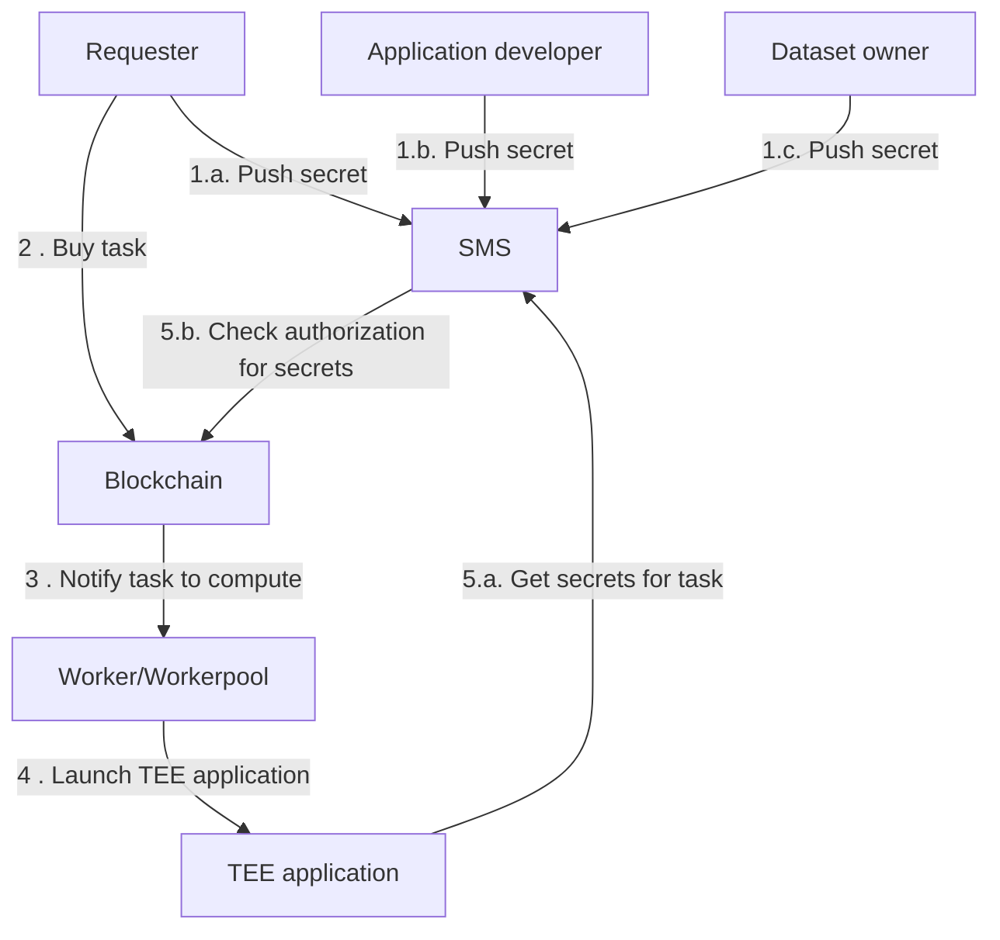

# Access confidential assets from your app

::: warning

Before going any further, make sure you managed to
[Build your first application with Scone framework](create-your-first-sgx-app.md).

:::

## Secret Management Service (SMS)

You can use confidential assets on iExec thanks to the _iExec Secret Management
Service_. This service verifies that the enclave asking for secrets is
authorized to do so. Any user - as a confidential asset provider - declares on
the blockchain which enclaves are authorized to access it. For each task, the
SMS will query the blockchain to determine if the enclave requesting secrets is
indeed whitelisted for it.

The SMS currently supports 3 types of secrets:

1. [Application developer secret](/guides/build-iapp/build-&-deploy#application-developer-secret): This secret is
   directly accessible from the application as an environment variable. It is
   owned by the developer of the application. It can be any kind of data (API
   key, private key, token, ..) as long as it respects the size limit (max. 4096
   kB).
2. [Requester secrets](/guides/build-iapp/inputs-and-outputs#access-requester-secrets): These secrets are directly
   accessible from the application as environment variables, as long as the
   requester has decided to share them with it. These secrets can be any kind of
   data as long as they respect the size limit (max. 4096 kB). Before buying a
   task, a requester secret is pushed into the SMS and is not linked to any
   application. When a requester buys a task, the requester can declare which
   secrets can be accessed by the application. Doing so, a single requester
   secret can be shared with multiple applications.
3. [Dataset secret](sgx-encrypted-dataset.md): A dataset secret is not directly
   accessible from the application but its decrypted content is. If a dataset is
   requested and authorized to be used in it, its content will be automatically
   decrypted in the application enclave. To monetize such a dataset on iExec,
   the original dataset must be encrypted using the iExec SDK, its encrypted
   counterpart must be publicly available and its encryption key pushed into the
   SMS.

Here is a general overview of how confidential assets are used on iExec:

## Next step?

You now understand how these three kinds of confidential assets work on iExec,
you can go one step further by learning how to manipulate them:

- [Attach a secret to your app](/guides/build-iapp/build-&-deploy#application-developer-secret)
- [Access requester secrets](/guides/build-iapp/inputs-and-outputs#access-requester-secrets)
- [Access a confidential dataset](sgx-encrypted-dataset.md)
