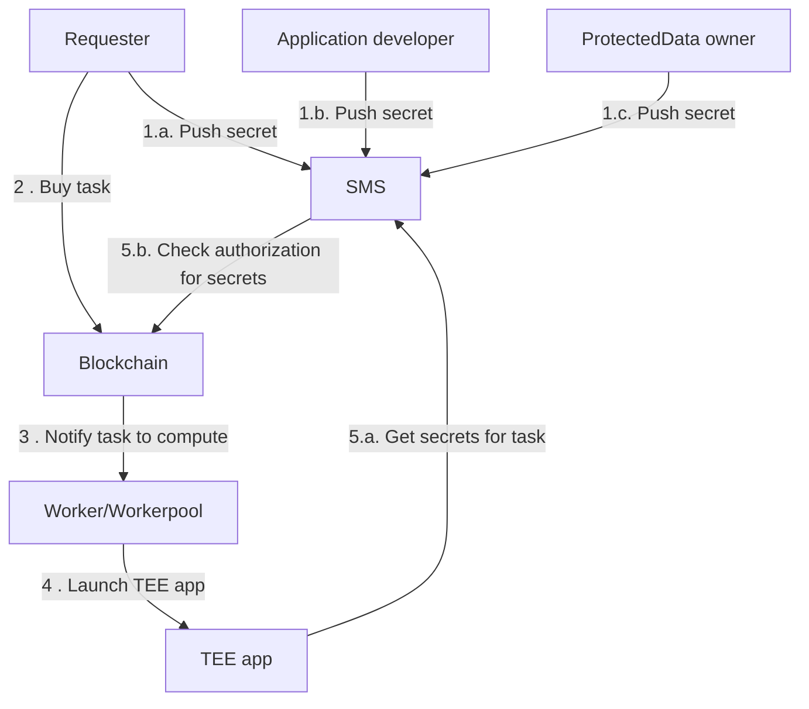

# Access confidential assets from your iApp

::: warning

Before going any further, make sure you managed to
[Build your first app with Scone framework](build-your-first-sgx-iapp.md).

:::

## Secret Management Service (SMS)

You can use confidential assets on iExec thanks to the _iExec Secret Management
Service_. This service verifies that the enclave asking for secrets is
authorized to do so. Any user - as a confidential asset provider - declares on
the blockchain which enclaves are authorized to access it. For each task, the
SMS will query the blockchain to determine if the enclave requesting secrets is
indeed whitelisted for it.

The SMS currently supports 3 types of secrets:

1. [App developer secret](/guides/build-iapp/build-&-test#application-developer-secret):
   This secret is directly accessible from the app as an environment variable.
   It is owned by the developer of the app. It can be any kind of data (API key,
   private key, token, ..) as long as it respects the size limit (max. 4096 kB).
2. [Requester secrets](/guides/build-iapp/inputs-and-outputs#access-requester-secrets):
   These secrets are directly accessible from the app as environment variables,
   as long as the requester has decided to share them with it. These secrets can
   be any kind of data as long as they respect the size limit (max. 4096 kB).
   Before buying a task, a requester secret is pushed into the SMS and is not
   linked to any app. When a requester buys a task, the requester can declare
   which secrets can be accessed by the app. Doing so, a single requester secret
   can be shared with multiple apps.
3. [Protected Data secret](/guides/manage-data/manage-access): A protected data
   secret is not directly accessible from the app but its decrypted content is.
   If a Protected Data is requested and authorized to be used in it, its content
   will be automatically decrypted in the app enclave.

Here is a general overview of how iExec uses confidential assets:

## Next step?

You now understand how these three kinds of confidential assets work on iExec,
you can go one step further by learning how to manipulate them:

- [Access to a Protected Data](/guides/build-iapp/inputs-and-outputs)
