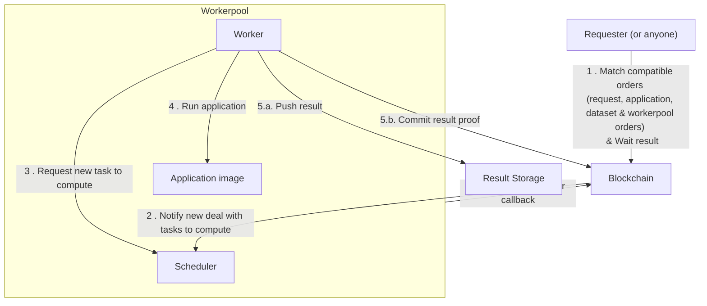

# Build your first app with Scone framework

In this tutorial, you will learn how to build and run a Confidential Computing
app with the Scone TEE framework.

::: warning

Before going any further, make sure you managed to
[Build and Test your iApp](../build-&-test).

:::

::: tip Prerequisites:

- [Docker](https://docs.docker.com/install/) 17.05 or higher on the daemon and
  client.
- [iExec SDK](https://www.npmjs.com/package/iexec) 8.0.0 or higher.
- Familiarity with the basic concepts of [Intel® SGX](/protocol/tee/intel-sgx)
  and [SCONE](https://scontain.com) framework.

:::

In order to follow this tutorial, you will need to register a
[free SCONE Account](https://scontain.com) to access SCONE build tools and
curated images from the [SCONE registry](https://gitlab.scontain.com/).

Once your account is activated, you need to
[request access to the SCONE build tools for iExec](mailto:info@scontain.com?cc=scone-access@iex.ec&subject=iExec%20Build%20Tools&body=Hi%20SCONE%20Team%2C%0D%0A%0D%0AI%20would%20like%20to%20get%20access%20to%20the%20SCONE%20build%20tools%20for%20iExec:%0A%20-%20scone-production/iexec-sconify-image%0A%20-%20sconecuratedimages%20%28all%20curated%20images%20such%20as%20nodejs%2C%20python...%29%0A%0AMy%20DockerID%20is%20...%0A%0ABest%20regards%0A%0A...).

```bash
# when your account is ready, run `docker login` to connect the SCONE registry
docker login registry.scontain.com
```

## Prepare your app

Before going further, your `<docker-hub-user>/hello-world:1.0.0` image built
previously is required.

If you missed that part, please go back to
[Build and Test your iApp](../build-&-test).

For this tutorial, you can reuse the same directory tree or create a new one.

To create a new directory tree, execute the following commands in
`~/iexec-projects/`.

```bash
cd ~/iexec-projects
mkdir tee-hello-world-app && cd tee-hello-world-app
iexec init --skip-wallet
mkdir src
touch Dockerfile
touch sconify.sh
chmod +x sconify.sh
```

### Write the iApp logic

Develop your code logic like the content below.The following examples only
feature Javascript and Python use cases for simplicity concerns but remember
that you can run on iExec anything which is Dockerizable.

**Copy the following content** in `src/` .

::: code-group

```javascript [src/app.js]
const fsPromises = require('fs').promises;

(async () => {
  try {
    const iexecOut = process.env.IEXEC_OUT;
    // Do whatever you want (let's write hello world here)
    const message = process.argv.length > 2 ? process.argv[2] : 'World';

    const text = `Hello, ${message}!`;
    console.log(text);
    // Append some results in /iexec_out/
    await fsPromises.writeFile(`${iexecOut}/result.txt`, text);
    // Declare everything is computed
    const computedJsonObj = {
      'deterministic-output-path': `${iexecOut}/result.txt`,
    };
    await fsPromises.writeFile(
      `${iexecOut}/computed.json`,
      JSON.stringify(computedJsonObj)
    );
  } catch (e) {
    console.log(e);
    process.exit(1);
  }
})();
```

```python [src/app.py]
import os
import sys
import json

iexec_out = os.environ['IEXEC_OUT']

# Do whatever you want (let's write hello world here)
text = 'Hello, {}!'.format(sys.argv[1] if len(sys.argv) > 1 else "World")
print(text)

# Append some results in /iexec_out/
with open(iexec_out + '/result.txt', 'w+') as fout:
    fout.write(text)

# Declare everything is computed
with open(iexec_out + '/computed.json', 'w+') as f:
    json.dump({ "deterministic-output-path" : iexec_out + '/result.txt' }, f)
```

:::

::: warning

As a developer, make it a rule to never log sensitive information in your
application. Execution logs are accessible by:

- worker(s) involved in the task
- the workerpool manager
- the requester of the task

:::

### Dockerize your iApp

**Copy the following content** in `Dockerfile` .

::: code-group

```bash [Dockerfile for JavaScript]
FROM node:22-alpine3.21
### install your dependencies if you have some
RUN mkdir /app && cd /app
COPY ./src /app
ENTRYPOINT [ "node", "/app/app.js"]
```

```bash [Dockerfile for Python]
FROM python:3.13.3-alpine3.21
### install python dependencies if you have some
COPY ./src /app
ENTRYPOINT ["python3", "/app/app.py"]
```

:::

Build the docker image.

::: warning

iExec expects your Docker container to be built for the `linux/amd64` platform.
However, if you develop on a **Mac** with Apple **M processor**, the platform is
`linux/arm64`, which is different. To prepare your application, you will need to
install `buildkit` and then prepare your docker image for both platforms.

```bash
brew install buildkit
# ARM64 variant for local testing only
docker buildx build --platform linux/arm64 --tag <docker-hub-user>/hello-world .
# AMD64 variant to deploy on iExec
docker buildx build --platform linux/amd64 --tag <docker-hub-user>/hello-world .
```

:::

```bash
docker build --tag hello-world .
```

::: tip

`docker build` produce an image id, using `--tag <name>` option is a convenient
way to name the image to reuse it in the next steps.

:::

**Congratulations you built your first docker image for iExec!**

## Test your iApp locally

### Basic test

Create local volumes to simulate input and output directories.

```bash
mkdir -p ./tmp/iexec_in
mkdir -p ./tmp/iexec_out
```

Run your application locally \(container volumes bound with local volumes\).

```bash
docker run --rm \
    -v ./tmp/iexec_in:/iexec_in \
    -v ./tmp/iexec_out:/iexec_out \
    -e IEXEC_IN=/iexec_in \
    -e IEXEC_OUT=/iexec_out \
    hello-world arg1 arg2 arg3
```

::: tip Docker run \[options\] image \[args\]

**docker run usage:**

`docker run [OPTIONS] IMAGE [COMMAND] [ARGS...]`

Use `[COMMAND]` and `[ARGS...]` to simulate the requester arguments

**useful options for iExec:**

`-v` : Bind mount a volume. Use it to bind input and output directories
(`/iexec_in` and `/iexec_out`)

`-e`: Set environnement variable. Use it to simulate iExec Runtime variables

:::

### Test with input files

Starting with the basic test you can simulate input files.

For each input file:

- Copy it in the local volume bound to `/iexec_in` .
- Add `-e IEXEC_INPUT_FILE_NAME_x=NAME` to docker run options \(`x` is the index
  of the file starting by 1 and `NAME` is the name of the file\)

Add `-e IEXEC_INPUT_FILES_NUMBER=n` to docker run options \(`n` is the total
number of input files\).

Example with two inputs files:

```bash
touch ./tmp/iexec_in/file1 && \
touch ./tmp/iexec_in/file2 && \
docker run \
    -v ./tmp/iexec_in:/iexec_in \
    -v ./tmp/iexec_out:/iexec_out \
    -e IEXEC_IN=/iexec_in \
    -e IEXEC_OUT=/iexec_out \
    -e IEXEC_INPUT_FILE_NAME_1=file1 \
    -e IEXEC_INPUT_FILE_NAME_2=file2 \
    -e IEXEC_INPUT_FILES_NUMBER=2 \
    hello-world \
    arg1 arg2 arg3
```

## Build the TEE docker image

Before wrapping your iExec confidential app with Scone, you need to generate a
custom signing key. The sconification process uses this key.

Generate your enclave signing key with:

```bash
openssl genrsa -3 -out enclave-key.pem 3072
```

This will create an `enclave-key.pem` file in your current directory. You will
use this file in the sconify Docker command to sign your TEE image.

Use the following script to wrap the sconification process, copy the
`sconify.sh` script in the current directory:

::: code-group

```bash [Javascript]
#!/bin/bash

# Declare image related variables
IMG_FROM=<docker-hub-user>/hello-world
IMG_TO=<docker-hub-user>/tee-scone-hello-world:1.0.0

# Run the sconifier to build the TEE image based on the non-TEE image
docker run -it --rm \
            -v $PWD/enclave-key.pem:/sig/enclave-key.pem \
            -v /var/run/docker.sock:/var/run/docker.sock \
            registry.scontain.com/scone-production/iexec-sconify-image:5.9.1-v16\
            sconify_iexec \
            --from=${IMG_FROM} \
            --to=${IMG_TO} \
            --binary-fs \
            --fs-dir=/app \
            --host-path=/etc/hosts \
            --host-path=/etc/resolv.conf \
            --binary=/usr/local/bin/node \
            --heap=1G \
            --dlopen=1 \
            --verbose \
            && echo -e "\n------------------\n" \
            && echo "successfully built TEE docker image => ${IMG_TO}" \
            && echo "app mrenclave.fingerprint is $(docker run --rm -e SCONE_HASH=1 ${IMG_TO})"
```

```bash [Python]
#!/bin/bash

# Declare image related variables
IMG_FROM=<docker-hub-user>/hello-world
IMG_TO=<docker-hub-user>/tee-scone-hello-world:1.0.0

# Run the sconifier to build the TEE image based on the non-TEE image
docker run -it --rm \
            -v $PWD/enclave-key.pem:/sig/enclave-key.pem \
            -v /var/run/docker.sock:/var/run/docker.sock \
            registry.scontain.com/scone-production/iexec-sconify-image:5.9.1-v16\
            sconify_iexec \
            --from=${IMG_FROM} \
            --to=${IMG_TO} \
            --binary-fs \
            --fs-dir=/app \
            --host-path=/etc/hosts \
            --host-path=/etc/resolv.conf \
            --binary=/usr/local/bin/python3 \
            --heap=1G \
            --dlopen=1 \
            --verbose \
            && echo -e "\n------------------\n" \
            && echo "successfully built TEE docker image => ${IMG_TO}" \
            && echo "app mrenclave.fingerprint is $(docker run --rm -e SCONE_HASH=1 ${IMG_TO})"
```

:::

Run the `sconify.sh` script to build the Scone TEE app:

```bash
./sconify.sh
```

Push your image on DockerHub:

```bash
docker login
docker push <docker-hub-user>/tee-scone-hello-world:1.0.0
```

Congratulations, you just built your Scone TEE app.

## Test your iApp on iExec

At this stage, your app is ready to be tested on iExec. The process is similar
to testing any type of app on the platform, with these minor exceptions:

### Deploy the TEE iApp on iExec

TEE apps require some additional information to be filled in during deployment.

```bash
# prepare the TEE app template
iexec app init --tee
```

Edit `iexec.json` and fill in the standard keys and the `mrenclave` object:

```json
{
  ...
  "app": {
    "owner": "<your-wallet-address>", // starts with 0x
    "name": "tee-scone-hello-world", // app name
    "type": "DOCKER",
    "multiaddr": "docker.io/<docker-hub-user>/tee-scone-hello-world:1.0.0", // app image
    "checksum": "<checksum>", // starts with 0x, update it with your own image digest
    "mrenclave": {
      "framework": "SCONE", // TEE framework (keep default value)
      "version": "v5.9", // Scone version (keep default value)
      "entrypoint": "node /app/app.js" OR "python3 /app/app.py", // update it with your own image entrypoint
      "heapSize": 1073741824, // heap size in bytes, update it with --heap option value used in sconify.sh script during TEE image build
      "fingerprint": "<mrenclave>" // fingerprint of the enclave code (mrenclave), without 0x prefix, see how to retrieve it below
    }
  },
  ...
}
```

::: info

Run your TEE image with `SCONE_HASH=1` to get the enclave fingerprint
(mrenclave):

```bash
docker run --rm -e SCONE_HASH=1 <docker-hub-user>/tee-scone-hello-world:1.0.0
```

:::

Deploy the iApp with the standard command:

```bash twoslash
iexec app deploy --chain {{chainName}}
```

You can check your deployed apps with their index, let's check your last
deployed app:

```bash twoslash
iexec app show --chain arbitrum-mainnet
```

## Run the iApp

iExec allows you to run applications on a decentralized infrastructure with
payment in **RLC** tokens.

::: info

To run an application you must have enough RLC staked on your iExec account to
pay for the computing resources.

Your iExec account is managed by smart contracts \(and not owned by iExec\).

When you request an execution the price for the task is locked from your
account's stake then transferred to accounts of the workers contributing to the
task \(read more about [Proof of Contribution](/protocol/proof-of-contribution)
protocol\).

At any time you can:

- view your balance

```bash twoslash
iexec account show --chain arbitrum-mainnet
```

- deposit RLC from your wallet to your iExec Account

```bash twoslash
iexec account deposit --chain arbitrum-mainnet <amount>
```

- withdraw RLC from your iExec account to your wallet \(only stake can be
  withdrawn\)

```bash twoslash
iexec account withdraw --chain arbitrum-mainnet <amount>
```

:::

One last thing, in order to run a **TEE** iApp you will also need to select a
workerpool, use the iexec workerpool `{{workerpoolAddress}}`.

You are now ready to run the iApp

```bash twoslash
iexec app run --chain {{chainName}} --tag tee,scone --workerpool {{workerpoolAddress}} --watch
```

The execution of tasks on the iExec network is asynchronous by design.



Guaranties about completion times (fast/slow) are available in the
[category section](/protocol/pay-per-task):

- maximum deal/task time
- maximum computing time

Once the task is completed copy the taskid from `iexec app run` output \(taskid
is a 32Bytes hexadecimal string\).

Download the result of your task

```bash twoslash
iexec task show --chain arbitrum-mainnet <taskid> --download my-result
```

You can get your taskid with the command:

```bash twoslash
iexec deal show --chain arbitrum-mainnet <dealid>
```

::: info

A task result is a zip file containing the output files of the application.

:::

[iexechub/python-hello-world](https://hub.docker.com/repository/docker/iexechub/python-hello-world)
produce an text file in `result.txt`.

Let's discover the result of the computation.

```bash
unzip my-result.zip -d my-result
cat my-result/result.txt
```

Congratulations! You successfully executed your application on iExec!

## Publish your app on the iExec Marketplace

Your application is deployed on iExec and you completed an execution on iExec.
For now, only you can request an execution of your application. The next step is
to publish it on the iExec Marketplace, making it available for anyone to use.

As the owner of this application, you can define the conditions under which it
can be used

::: info

iExec uses orders signed by the resource owner's wallet to ensure resources
governance.

The conditions to use an app are defined in the **apporder**.

:::

Publish a new apporder for your application.

```bash twoslash
iexec app publish --chain arbitrum-mainnet
```

::: info

`iexec app publish` command allows to define custom access rules to the app
\(run `iexec app publish --help` to discover all the possibilities\).

You will learn more about orders management later, keep the apporder default
values for now.

:::

Your application is now available for everyone on iExec marketplace on the
conditions defined in apporder.

You can check the published apporders for your app

```bash twoslash
iexec orderbook app --chain arbitrum-mainnet <your app address>
```

Congratulation you just created a decentralized application! Anyone can now
trigger an execution of your application on the iExec decentralized
infrastructure.

## Next step?

In this tutorial, you learned how to leverage your app with the power of Trusted
Execution Environments using iExec. But according to your use case, you may need
to use some confidential data to get the full potential of the **Confidential
Computing** paradigm. Check out next chapters to see how:

- [Access confidential assets from your iApp](access-confidential-assets.md)
- [Protect the result](/guides/build-iapp/advanced/protect-the-result.md)

<script setup>
import { computed } from 'vue';
import useUserStore  from '@/stores/useUser.store';
import {getChainById} from '@/utils/chain.utils';

// Get current chain info
const userStore = useUserStore();
const selectedChain = computed(() => userStore.getCurrentChainId());

const chainData = computed(() => getChainById(selectedChain.value));
const chainName = computed(() => chainData.value.chainName);
const workerpoolAddress = computed(() => chainData.value.workerpoolAddress);
</script>
