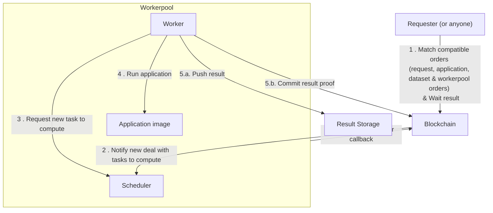

# Build your first TDX iApp

In this tutorial, you will learn how to build and run a Confidential Computing
app with **Intel TDX (Trust Domain Extensions)** on the iExec protocol.

::: tip Prerequisites

- [Docker](https://docs.docker.com/install/) 17.05 or higher on the daemon and
  client.
- [iExec SDK](https://www.npmjs.com/package/iexec) 8.24.0 or higher.
- Familiarity with the basics of [Intel TDX](/protocol/tee/intel-tdx) and the
  iExec workflow described in
  [Deploy and run an iApp](/guides/build-iapp/deploy-&-run).

:::

Unlike the legacy SGX/SCONE flow, **TDX does not require** a separate
sconification step: you build a **standard** `linux/amd64` OCI image, push it to
a registry, and configure the iExec app for the TDX framework (see
**[Intel TDX Technology](/protocol/tee/intel-tdx)** for what TDX provides).

## Prepare your app

For this tutorial, create a new directory tree. Execute the following commands
in `~/iexec-projects/`:

```bash
cd ~/iexec-projects
mkdir tee-hello-world-tdx && cd tee-hello-world-tdx
iexec init --skip-wallet
mkdir src
touch Dockerfile
```

### Write the iApp logic

Develop your code logic as below. The following examples use JavaScript and
Python for brevity; any workload that fits in a Docker image can be used on
iExec.

**Copy the following content** in `src/`.

::: code-group

```javascript [src/app.js]
const fsPromises = require('fs').promises;

(async () => {
  try {
    const iexecOut = process.env.IEXEC_OUT;
    // Do whatever you want (let's write hello world here)
    const message = process.argv.length > 2 ? process.argv[2] : 'World';

    const text = `Hello, ${message}!`;
    console.log(text);
    // Append some results in /iexec_out/
    await fsPromises.writeFile(`${iexecOut}/result.txt`, text);
    // Declare everything is computed
    const computedJsonObj = {
      'deterministic-output-path': `${iexecOut}/result.txt`,
    };
    await fsPromises.writeFile(
      `${iexecOut}/computed.json`,
      JSON.stringify(computedJsonObj)
    );
  } catch (e) {
    console.log(e);
    process.exit(1);
  }
})();
```

```python [src/app.py]
import os
import sys
import json

iexec_out = os.environ['IEXEC_OUT']

# Do whatever you want (let's write hello world here)
text = 'Hello, {}!'.format(sys.argv[1] if len(sys.argv) > 1 else "World")
print(text)

# Append some results in /iexec_out/
with open(iexec_out + '/result.txt', 'w+') as fout:
    fout.write(text)

# Declare everything is computed
with open(iexec_out + '/computed.json', 'w+') as f:
    json.dump({ "deterministic-output-path" : iexec_out + '/result.txt' }, f)
```

:::

::: warning

As a developer, make it a rule to never log sensitive information in your
application. Execution logs are accessible by:

- worker(s) involved in the task
- the workerpool manager
- the requester of the task

:::

### Dockerize your iApp

**Copy the following content** in `Dockerfile`.

::: code-group

```bash [Dockerfile for JavaScript]
FROM node:22-alpine3.21
### install your dependencies if you have some
RUN mkdir /app && cd /app
COPY ./src /app
ENTRYPOINT [ "node", "/app/app.js"]
```

```bash [Dockerfile for Python]
FROM python:3.13.3-alpine3.21
### install python dependencies if you have some
COPY ./src /app
ENTRYPOINT ["python3", "/app/app.py"]
```

:::

Build the docker image.

::: warning

iExec expects your Docker container to be built for the `linux/amd64` platform.
On a **Mac** with an **Apple Silicon** chip, the default platform is
`linux/arm64`. Use buildx to produce the image for `linux/amd64`.

```bash
brew install buildkit
# ARM64 variant for local testing only
docker buildx build --platform linux/arm64 --tag <docker-hub-user>/hello-world .
# AMD64 variant to deploy on iExec
docker buildx build --platform linux/amd64 --tag <docker-hub-user>/hello-world:1.0.0 --load .
```

:::

```bash
docker build --tag <docker-hub-user>/hello-world:1.0.0 .
```

::: tip

`docker build` produces an image id; using `--tag <name>:<version>` is a
convenient way to name the image for the next steps.

:::

## Test your iApp locally

### Basic test

Create local volumes to simulate input and output directories.

```bash
mkdir -p ./tmp/iexec_in
mkdir -p ./tmp/iexec_out
```

Run your application locally (container volumes bound with local volumes).

```bash
docker run --rm \
    -v ./tmp/iexec_in:/iexec_in \
    -v ./tmp/iexec_out:/iexec_out \
    -e IEXEC_IN=/iexec_in \
    -e IEXEC_OUT=/iexec_out \
    <docker-hub-user>/hello-world:1.0.0 arg1 arg2 arg3
```

::: tip Docker run [options] image [args]

**docker run usage:**

`docker run [OPTIONS] IMAGE [COMMAND] [ARGS...]`

Use `[COMMAND]` and `[ARGS...]` to simulate the requester arguments.

**Useful options for iExec:**

`-v` : Bind mount a volume. Use it to bind input and output directories
(`/iexec_in` and `/iexec_out`)

`-e`: Set environment variable. Use it to simulate iExec runtime variables

:::

### Test with input files

Starting with the basic test, you can simulate input files.

For each input file:

- Copy it in the local volume bound to `/iexec_in`.
- Add `-e IEXEC_INPUT_FILE_NAME_x=NAME` to docker run options (`x` is the index
  of the file starting at 1 and `NAME` is the name of the file)

Add `-e IEXEC_INPUT_FILES_NUMBER=n` to docker run options (`n` is the total
number of input files).

Example with two input files:

```bash
touch ./tmp/iexec_in/file1 && \
touch ./tmp/iexec_in/file2 && \
docker run \
    -v ./tmp/iexec_in:/iexec_in \
    -v ./tmp/iexec_out:/iexec_out \
    -e IEXEC_IN=/iexec_in \
    -e IEXEC_OUT=/iexec_out \
    -e IEXEC_INPUT_FILE_NAME_1=file1 \
    -e IEXEC_INPUT_FILE_NAME_2=file2 \
    -e IEXEC_INPUT_FILES_NUMBER=2 \
    <docker-hub-user>/hello-world:1.0.0 \
    arg1 arg2 arg3
```

## Build and push your Docker image for TDX

For **TDX**, you use the **same** image you built and tested: there is no
enclave packaging step. Ensure the image is built for `linux/amd64`, then push
it to Docker Hub (or another registry you reference in `iexec.json`).

```bash
docker login
docker push <docker-hub-user>/hello-world:1.0.0
```

You are now ready to register and run this image as a TDX iApp on iExec.

## Test your iApp on iExec

At this stage, your app is ready to be tested on iExec. The process is similar
to testing a non-TEE app, with TDX-specific settings below.

### Update `chain.json` {#update-chain-json}

Point the iExec client to the **TDX** Secret Management Service (SMS) for your
target network. Edit `chain.json` as follows (or create it if missing):

::: code-group

```json [Arbitrum Sepolia (testnet)]
{
  "default": "arbitrum-sepolia-testnet",
  "chains": {
    "arbitrum-sepolia-testnet": {
      "sms": { "tdx": "https://sms.labs.iex.ec" }
    }
  }
}
```

```json [Arbitrum Mainnet]
{
  "default": "arbitrum-mainnet",
  "chains": {
    "arbitrum-mainnet": {
      "sms": { "tdx": "https://sms.arbitrum-mainnet.iex.ec" }
    }
  }
}
```

:::

### Deploy the TEE iApp on iExec

TEE apps require additional fields during deployment. Prepare the TEE app
template and select the **TDX** framework:

```bash
iexec app init --tee-framework tdx
```

Edit `iexec.json` and fill in the standard keys and the TDX `mrenclave` object:

```json
{
  ...
  "app": {
    "owner": "<your-wallet-address>", // starts with 0x
    "name": "tee-tdx-hello-world", // app name
    "type": "DOCKER",
    "multiaddr": "docker.io/<docker-hub-user>/hello-world:1.0.0", // app image
    "checksum": "<checksum>", // starts with 0x, update with your image digest
  },
  ...
}
```

::: info

See [Deploy your iApp on iExec](/guides/build-iapp/deploy-&-run.md) to obtain
your image `<checksum>` (digest).

:::

Deploy the iApp:

```bash twoslash
iexec app deploy --chain {{chainName}}
```

List your last deployed app:

```bash twoslash
iexec app show --chain {{chainName}}
```

## Run the iApp

iExec runs applications on decentralized infrastructure; execution is paid in
**RLC** on Arbitrum networks.

::: info

To run an application you must have enough RLC staked on your iExec account to
pay for the computing resources.

When you request an execution, the task cost is reserved from your account’s
stake, then distributed to workers (see
[Proof of Contribution](/protocol/proof-of-contribution)).

At any time you can:

- view your balance

```bash twoslash
iexec account show --chain {{chainName}}
```

- deposit RLC from your wallet to your iExec account

```bash twoslash
iexec account deposit --chain {{chainName}} <amount>
```

- withdraw RLC from your iExec account to your wallet (only stake can be
  withdrawn)

```bash twoslash
iexec account withdraw --chain {{chainName}} <amount>
```

:::

To run a **TDX** iApp, use the TEE **tee** and **tdx** tags and a **TDX
workerpool** for the target network.

```bash twoslash
iexec app run --chain {{chainName}} --tag tee,tdx --workerpool {{workerpoolAddress}} --watch
```

::: code-group

```bash [Arbitrum Sepolia (testnet)]
iexec app run --chain arbitrum-sepolia-testnet --tag tee,tdx --workerpool 0x2956f0cb779904795a5f30d3b3ea88b714c3123f --watch
```

```bash [Arbitrum Mainnet]
iexec app run --chain arbitrum-mainnet --tag tee,tdx --workerpool 0x8ef2ec3ef9535d4b4349bfec7d8b31a580e60244 --watch
```

:::

Task execution on iExec is asynchronous.



Guarantees about completion times (fast/slow) are described in the
[category section](/protocol/pay-per-task): maximum deal/task time, maximum
computing time, etc.

When the task completes, copy the `taskid` from the `iexec app run` output (a
32-byte hex string).

Download the result:

```bash twoslash
iexec task show --chain {{chainName}} <taskid> --download my-result
```

You can get the `taskid` for a `dealid` with:

```bash twoslash
iexec deal show --chain {{chainName}} <dealid>
```

::: info

A task result is a zip file containing the application output files.

:::

For this hello-world app, the output includes `result.txt`. Unpack and read it:

```bash
unzip my-result.zip -d my-result
cat my-result/result.txt
```

Congratulations! You have executed your application on iExec in a TDX Trust
Domain.

## Publish your app on the iExec Marketplace

Your app is deployed and you have completed an execution. To let others run it,
publish an **apporder** (see
[iApp access and pricing](/guides/build-iapp/manage-access) for how orders
work).

```bash twoslash
iexec app publish --chain {{chainName}}
```

::: info

`iexec app publish` allows custom access rules (`iexec app publish --help`).

:::

Check published app orders:

```bash twoslash
iexec orderbook app --chain {{chainName}} <your app address>
```

## Next steps

In this tutorial you used **Intel TDX** on iExec to run a confidential workload.
To go further with confidential data and result protection:

- [Access confidential assets from your iApp](/guides/build-iapp/advanced/access-confidential-assets)
- [Protect the result](/guides/build-iapp/advanced/protect-the-result)

Deeper TEE context:

- [Intel TDX Technology](/protocol/tee/intel-tdx)
- [Introduction to TEE technologies](/protocol/tee/introduction)

## Using iApp Generator

The [iApp Generator](/references/iapp-generator) can deploy and run **TDX** apps
with less manual `iexec.json` editing.

### Enabling TDX in iApp Generator

**Enable TDX for deployment and execution:**

```bash
iapp deploy
iapp run <app-address>
```

**Per command:**

```bash
iapp deploy
iapp run <app-address>
iapp debug <taskId>
```

**Verify TEE tags on the app:**

```bash
iexec app show <app-address>
```

### DataProtector SDK with TDX

To use **DataProtector** with TDX, point the SDK at the TDX SMS (same hosts as
in [Update `chain.json`](#update-chain-json) above).

::: code-group

```jsx [Arbitrum Sepolia (testnet)]
const dataProtector = new IExecDataProtector(web3Provider, {
  iexecOptions: {
    smsURL: 'https://sms.labs.iex.ec',
  },
});
```

```jsx [Arbitrum Mainnet]
const dataProtector = new IExecDataProtector(web3Provider, {
  iexecOptions: {
    smsURL: 'https://sms.arbitrum-mainnet.iex.ec',
  },
});
```

:::

Pass the TDX **workerpool** in `processProtectedData`:

::: code-group

```jsx [Arbitrum Sepolia (testnet)]
await dataProtector.core.processProtectedData({
  protectedData: protectedData.address,
  workerpool: '0x2956f0cb779904795a5f30d3b3ea88b714c3123f',
  app: '0x456def...',
});
```

```jsx [Arbitrum Mainnet]
await dataProtector.core.processProtectedData({
  protectedData: protectedData.address,
  workerpool: '0x8ef2ec3ef9535d4b4349bfec7d8b31a580e60244',
  app: '0x456def...',
});
```

:::

TDX iApps may require **TDX-compatible** protected data. Check the latest
[DataProtector](/references/dataProtector) documentation for requirements.

**Local test (same as non-TEE):**

```bash
iapp test --protectedData "mock_name"
```

### Related resources

- [iApp Generator reference](/references/iapp-generator)
- [Debugging your iApp](/guides/build-iapp/debugging)
- [Inputs](/guides/build-iapp/inputs) / [Outputs](/guides/build-iapp/outputs)
- [iApp access and pricing](/guides/build-iapp/manage-access)

<script setup>
import { computed } from 'vue';
import useUserStore  from '@/stores/useUser.store';
import {getChainById} from '@/utils/chain.utils';

const userStore = useUserStore();
const selectedChain = computed(() => userStore.getCurrentChainId());

const chainData = computed(() => getChainById(selectedChain.value));
const chainName = computed(() => chainData.value?.chainName ?? 'arbitrum-sepolia-testnet');
const workerpoolAddress = computed(() => chainData.value?.workerpoolAddress ?? '0x2956f0cb779904795a5f30d3b3ea88b714c3123f');
</script>
