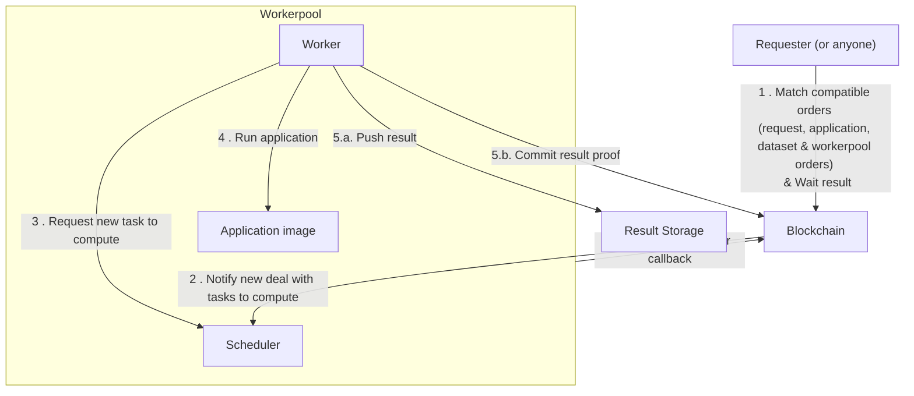

# Quick Start

> In this tutorial we will show you how you can create decentralized application
> over the iExec infrastructure.

iExec enables decentralized docker app deployment and monetization on the
blockchain.

In this guide, we will use the iExec SDK command-line interface to deploy an
iExec app on a test blockchain.

## Install the iExec SDK

Requirements:
[](https://nodejs.org/en/)

```bash
npm -g install iexec # install the CLI
iexec --version
iexec --help
```

## Create your identity on the blockchain

On the blockchain, your identity is defined by your **wallet,** consisting of
cryptographically encrypted **private key** and **public address.** What you own
on the blockchain is associated with your address. The applications you deploy
on iExec are associated with your wallet.

Let's set up your wallet.

Create a new Wallet file

```text
iexec wallet create
```

You will be asked to choose a password to protect your wallet, don't forget it
since there is no way to recover it. The SDK creates a wallet file that contains
a randomly generated private key encrypted by the chosen password and the
derived public address. Make sure to back up the wallet file in a safe place and
write down your address.

::: tip Your wallet is stored in the ethereum keystore, the location depends on
your OS:

- On Linux: ~/.ethereum/keystore
- On Mac : ~/Library/Ethereum/keystore
- On Windows: ~/AppData/Roaming/Ethereum/keystore

Wallet file name follow the pattern `UTC--<CREATION_DATE>--<ADDRESS>`

:::

::: info

iExec SDK uses standard Ethereum wallet, you can reuse or import existing
Ethereum wallet. See iExec SDK documentation
[wallet command](https://github.com/iExecBlockchainComputing/iexec-sdk/blob/v8.1.5/CLI.md#iexec-wallet).

:::

## Initialize your iExec project

Create a new folder for your iExec project and initialize the project:

```bash
mkdir ~/iexec-projects
cd ~/iexec-projects
iexec init --skip-wallet
```

::: info

The iExec SDK creates the minimum configuration files:

- `iexec.json` contains the project configuration
- `chain.json` contains the blockchain connection configuration
- we use `--skip-wallet` to skip wallet creation as we already created it

:::

You can now connect to the desired supported blockchain. In the following steps,
we will use the chosen blockchain to deploy and run your iExec app. See the
[supported blockchains](/get-started/tooling-and-explorers/blockchain-explorer)
for a full list.

You can now check your wallet content:

```bash
iexec wallet show
```

## Deploy your app on iExec

iExec enables decentralized deployment of dockerized applications. The
applications deployed on iExec are Smart Contracts identified by their Ethereum
address and referencing a public docker image. Each iExec application has an
owner who can set the execution permissions on iExec platform.

Let's deploy an iExec app!

Initialize a new application

```bash
iexec app init
```

The iExec SDK writes the minimum app configuration in `iexec.json`

| **key**   | **description**                                                             |
| --------- | --------------------------------------------------------------------------- |
| owner     | app owner ethereum address \(default your wallet address\)                  |
| name      | name of the application                                                     |
| type      | type of application \("DOCKER" for docker container\)                       |
| multiaddr | download URI of the application \(a public docker registry\)                |
| checksum  | checksum of the app \("0x" + docker image digest\)                          |
| mrenclave | app fingerprint used for confidential computing use cases \(default empty\) |

::: info

The default app is the public docker image
[iexechub/python-hello-world](https://hub.docker.com/repository/docker/iexechub/python-hello-world).

Given an input string, the application generates an ASCII art greeting.

:::

You can deploy this application on iExec, it will run out of the box. When you
are confident with iExec concept, you can read
[Your first app](./build-your-first-sgx-iapp.md) and learn how to setup your own
app on iExec.

You will now deploy your app on iExec, this will be your first transaction on
the blockchain:

```bash twoslash
iexec app deploy --chain arbitrum-mainnet
```

::: tip

While running `iexec app deploy` you sent your first transaction on the
arbitrum-mainnet blockchain.

:::

You can check your deployed apps with their index, let's check your last
deployed app:

```bash twoslash
iexec app show --chain arbitrum-mainnet
```

## Run your app on iExec

iExec allows you to run applications on a decentralized infrastructure with
payment in **RLC** tokens \(the native cryptocurrency of iExec\).

::: info

To run an application you must have enough RLC staked on your iExec account to
pay for the computing resources.

Your iExec account is managed by smart contracts \(and not owned by iExec\).

When you request an execution the price for the task is locked from your
account's stake then transferred to accounts of the workers contributing to the
task \(read more about [Proof of Contribution](/protocol/proof-of-contribution)
protocol\).

At any time you can:

- view your balance

```bash twoslash
iexec account show --chain arbitrum-mainnet
```

- deposit RLC from your wallet to your iExec Account

```bash twoslash
iexec account deposit --chain arbitrum-mainnet <amount>
```

- withdraw RLC from your iExec account to your wallet \(only stake can be
  withdrawn\)

```bash twoslash
iexec account withdraw --chain arbitrum-mainnet <amount>
```

:::

Currently, iExec sponsors applications running on Bellecour, and you won't have
to pay for the computation.

Everything is ready to run your application!

```bash twoslash
iexec app run --chain arbitrum-mainnet --args <your-name-here> --workerpool {{workerpoolAddress}} --watch
```

::: info

`iexec app run` allows to run an application on iExec at the market price.

Useful options:

- `--args <args>` specify the app execution arguments
- `--watch` watch execution status changes
- `--workerpool <address>` specify the workerpool to use (for example:
  `--workerpool {{workerpoolAddress}}`)

Discover more option with `iexec app run --help`

:::

::: tip Congratulation you requested the execution of
[iexechub/python-hello-world](https://hub.docker.com/repository/docker/iexechub/python-hello-world).

This will generate an ASCII art greeting with your name.

:::

The execution of tasks on the iExec network is asynchronous by design.



Guaranties about completion times (fast/slow) are available in the
[category section](/protocol/pay-per-task):

- maximum deal/task time
- maximum computing time

Once the task is completed copy the taskid from `iexec app run` output \(taskid
is a 32Bytes hexadecimal string\).

Download the result of your task

```bash twoslash
iexec task show --chain arbitrum-mainnet <taskid> --download my-result
```

You can get your taskid with the command:

```bash twoslash
iexec deal show --chain arbitrum-mainnet <dealid>
```

::: info

A task result is a zip file containing the output files of the application.

:::

[iexechub/python-hello-world](https://hub.docker.com/repository/docker/iexechub/python-hello-world)
produce an text file in `result.txt`.

Let's discover the result of the computation.

```bash
unzip my-result.zip -d my-result
cat my-result/result.txt
```

Congratulations! You successfully executed your application on iExec!

## Publish your app on the iExec Marketplace

Your application is deployed on iExec and you completed an execution on iExec.
For now, only you can request an execution of your application. The next step is
to publish it on the iExec Marketplace, making it available for anyone to use.

As the owner of this application, you can define the conditions under which it
can be used

::: info

iExec uses orders signed by the resource owner's wallet to ensure resources
governance.

The conditions to use an app are defined in the **apporder**.

:::

Publish a new apporder for your application.

```bash twoslash
iexec app publish --chain arbitrum-mainnet
```

::: info

`iexec app publish` command allows to define custom access rules to the app
\(run `iexec app publish --help` to discover all the possibilities\).

You will learn more about orders management later, keep the apporder default
values for now.

:::

Your application is now available for everyone on iExec marketplace on the
conditions defined in apporder.

You can check the published apporders for your app

```bash twoslash
iexec orderbook app --chain arbitrum-mainnet <your app address>
```

Congratulation you just created a decentralized application! Anyone can now
trigger an execution of your application on the iExec decentralized
infrastructure.

## What's next?

You are now familiar with the following key iExec concepts for developers:

- Your wallet is your on-chain ID and blockchain account
- You can deploy decentralized applications on iExec
- Anyone can run tasks against payment in RLC on iExec
- Payments are processed by the decentralized platform between users' iExec
  Accounts
- Resource governance is managed by orders

Continue with these guides:

- [Learn how to build your first condiential application running on iExec](./build-your-first-sgx-iapp.md)

<script setup>
import { computed } from 'vue';
import useUserStore  from '@/stores/useUser.store';
import {getChainById} from '@/utils/chain.utils';

// Get current chain info
const userStore = useUserStore();
const selectedChain = computed(() => userStore.getCurrentChainId());

const chainData = computed(() => getChainById(selectedChain.value));
const chainName = computed(() => chainData.value.chainName);
const workerpoolAddress = computed(() => chainData.value.workerpoolAddress);
</script>
