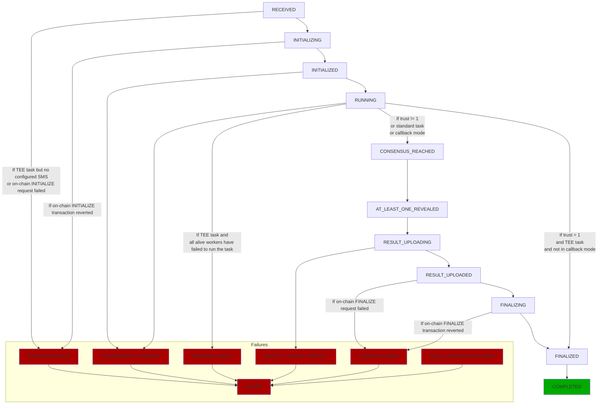
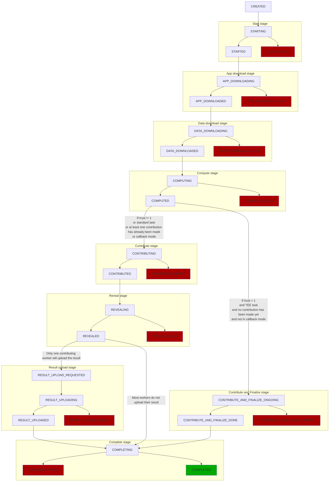

# Debug your tasks

## Debug your app on iExec

Sometimes things don't work out right the first time and you may need to debug
your application.

- Get debug information of a _task_

```bash
iexec task debug <taskid>
```

It allows anyone to know on-chain and off-chain statuses of the _task_.

- Get debug logs of a _task_

```bash
iexec task debug <taskid> --logs
```

It allows the requester to retrieve application logs produced by workers.

## Off-chain statuses

### Task statuses

During its execution, a _task_ transitions between different off-chain statuses.
Those statuses let you track how a _task_ progresses when it's being executed
and makes it easier for you to debug if the execution fails. The transitions
between those statuses are as follows.



::: warning

Please note that, for the sake of simplicity, transitions to the
`FINAL_DEADLINE_REACHED` status have not been pictured. In fact, all statuses
except final statuses (`FAILED` and `COMPLETED`) can lead to this
`FINAL_DEADLINE_REACHED` status.

As a reminder, _tasks_ have a max execution time, defined by their category.
Their final deadlines are defined as follows: `deal start time` +
`max execution time`. When a _task_ update is triggered on a _Scheduler_ for a
non-completed non-failed _task_ while its final deadline is met, then this
_task_ status transitions to `FINAL_DEADLINE_REACHED`.

:::

Below the description of each status:

| Task status             | Description                                                                |
| ----------------------- | -------------------------------------------------------------------------- |
| `RECEIVED`              | The Scheduler has detected the deal                                        |
| `INITIALIZING`          | The Scheduler is trying to set the _task_ on-chain status to `INITIALIZED` |
| `INITIALIZED`           | The _task_ on-chain status has been correctly set to `INITIALIZED`         |
| `RUNNING`               | At least one Worker has started to work on the _task_                      |
| `CONSENSUS_REACHED`     | The consensus has been reached                                             |
| `AT_LEAST_ONE_REVEALED` | At least one Worker revealed its result                                    |
| `RESULT_UPLOADING`      | The selected Worker is uploading its result                                |
| `RESULT_UPLOADED`       | The result has been uploaded                                               |
| `FINALIZING`            | The Scheduler is trying to set the _task_ on-chain status to `FINALIZED`   |
| `FINALIZED`             | The _task_ on-chain status has been correctly set to `FINALIZED`           |

However, things sometimes don't work as expected. In that case, failure statuses
help to understand what went wrong:

| Task status              | Description                                                                  |
| ------------------------ | ---------------------------------------------------------------------------- |
| `INITIALIZE_FAILED`      | _Task_ on-chain initialization failed                                        |
| `RUNNING_FAILED`         | All Workers have failed to run this TEE _task_                               |
| `CONTRIBUTION_TIMEOUT`   | Contribution deadline has been reached before any contribution has been sent |
| `RESULT_UPLOAD_TIMEOUT`  | The final deadline has been reached while the result was being uploaded      |
| `FINALIZE_FAILED`        | _Task_ on-chain finalization failed                                          |
| `FINAL_DEADLINE_REACHED` | The final deadline has been reached                                          |
| `FAILED`                 | Final status for any previous failure                                        |

### Replicate statuses

One _task_ bought by a requester will result in one off-chain _task_ with one or
more _replicates_ depending on the level of trust set by the requester. For a
given _task_, each worker involved in the computation will have its own
_replicate_ containing the description of the _task_ to compute. The whole
computation of a _replicate_ is made of several stages. Each stage completed by
a worker will result in an update of its _replicate_ status.

The links between a _task_ to its _replicates_ can be represented as follows:

```bash
task1
├── replicate1 (workerX)
├── replicate2 (workerY)
└── replicate3 (workerZ)
```

A replicate status workflow can follow two different flows:

1. Usual flow (default): the _task_ is replicated on a number of _workers_,
   depending on required trust. The _Scheduler_ has to notify the _workers_ when
   the consensus is reached. It should also finalize the _task_ on-chain.
2. Optimized flow (under conditions): the _task_ is finalized by the only
   _worker_ that has worked on it. It makes the _task_ execution faster and
   cheaper. However, some limitations apply:
   1. The _worker_ has to be trustworthy. To achieve this point, only TEE
      _tasks_ are eligible to this workflow.
   2. Callback mode is currently unsupported. iExec strives to remove this
      limitation.

See the following flowchart for details on their transitions.



::: warning

Please note that all failed status - pictured in red in the above diagram -
finally lead to `ABORTED`. For the sake of simplicity, this final status has not
been represented here.

:::

While the _task_ holds a meta status, each _replicate_ has its own status which
can be one of these:

| Replicate status                  | Description                                                                                                                                                  |
| --------------------------------- | ------------------------------------------------------------------------------------------------------------------------------------------------------------ |
| `CREATED`                         | A new _replicate_ is assigned to a worker just after it asked for more work                                                                                  |
| `STARTING`                        | The worker starts preflight checks to confirm it can work on this _replicate_                                                                                |
| `STARTED`                         | The worker confirms it is going to work on this _replicate_                                                                                                  |
| `START_FAILED`                    | The preflight checks have failed. The worker will NOT work on this _replicate_                                                                               |
| `APP_DOWNLOADING`                 | The worker is downloading the application                                                                                                                    |
| `APP_DOWNLOADED`                  | The download of the application is completed                                                                                                                 |
| `APP_DOWNLOAD_FAILED`             | The download of the application failed                                                                                                                       |
| `DATA_DOWNLOADING`                | The worker is downloading the dataset                                                                                                                        |
| `DATA_DOWNLOADED`                 | The download of the dataset is completed                                                                                                                     |
| `DATA_DOWNLOAD_FAILED`            | The download of the dataset failed                                                                                                                           |
| `COMPUTING`                       | The worker is computing the _task_                                                                                                                           |
| `COMPUTED`                        | The computation is completed                                                                                                                                 |
| `COMPUTE_FAILED`                  | The computation failed                                                                                                                                       |
| `CONTRIBUTING`                    | The worker sent the "contribute(..)" transaction (result digest) on chain                                                                                    |
| `CONTRIBUTE_FAILED`               | The contribute transaction failed                                                                                                                            |
| `CONTRIBUTED`                     | The worker has contributed on chain                                                                                                                          |
| `REVEALING`                       | The worker sent the "reveal(..)" transaction (proof that he is the owner of the result digest)                                                               |
| `REVEALED`                        | The worker has revealed the proof on chain                                                                                                                   |
| `REVEAL_FAILED`                   | The reveal transaction failed                                                                                                                                |
| `RESULT_UPLOAD_REQUESTED`         | The worker has been requested to upload the result to a remote filesystem                                                                                    |
| `RESULT_UPLOADING`                | The worker is uploading the result                                                                                                                           |
| `RESULT_UPLOAD_FAILED`            | The upload of the result failed                                                                                                                              |
| `RESULT_UPLOADED`                 | The result has been uploaded to IPFS over the _iExec Result Proxy_ (standard or TEE _tasks_) or to Dropbox (TEE only), dependending on the _deal_ parameters |
| `CONTRIBUTE_AND_FINALIZE_ONGOING` | The worker sent the "contributeAndFinalize(...)" transaction on chain                                                                                        |
| `CONTRIBUTE_AND_FINALIZE_DONE`    | The worker has contributed and finalized the task. The latter is now considered as completed on-chain                                                        |
| `CONTRIBUTE_AND_FINALIZE_FAILED`  | The contributeAndFinalize transaction failed                                                                                                                 |
| `COMPLETING`                      | The _task_ is finalized, the worker will purge data related to its _replicate_                                                                               |
| `COMPLETED`                       | The whole _task_ is completed meaning the _task_ is finalized. The worker has been rewarded if it is part of the consensus                                   |
| `COMPLETE_FAILED`                 | The worker failed to clean the local _replicate_ resources after the _task_ is finalized                                                                     |
| `FAILED`                          | The worker failed to participate to the _task_                                                                                                               |
| `ABORTED`                         | The scheduler asked the worker to stop working on this _replicate_ while the latter was still working on it                                                  |
| `RECOVERING`                      | The worker has been stopped, it is starting back from where it stopped                                                                                       |
| `WORKER_LOST`                     | The worker didn't ping the iexec-core scheduler for a while. It is considered as out for this _task_                                                         |

### Off-chain replicates failure causes

When a worker fails to complete a _replicate_, it returns a failure cause. This
cause is helpful to understand what went wrong.

#### Failures detected by the Scheduler

| Replicate failure cause | Description                                                                            |
| ----------------------- | -------------------------------------------------------------------------------------- |
| `REVEAL_TIMEOUT`        | The worker took too long to reveal its proof (more than 2 periods after the consensus) |

#### Failures from Worker

A _replicate_ can fail with the following causes:

##### Common failures

| Replicate failure cause                         | Replicate status                                                               | Description                                                                   |
| ----------------------------------------------- | ------------------------------------------------------------------------------ | ----------------------------------------------------------------------------- |
| `CHAIN_UNREACHABLE`                             | `STARTING`, `APP_DOWNLOADING`, `DATA_DOWNLOADING`, `COMPUTING`, `CONTRIBUTING` | The _task_ model could not be fetched from the blockchain                     |
| `STAKE_TOO_LOW`                                 | `STARTING`, `APP_DOWNLOADING`, `DATA_DOWNLOADING`, `COMPUTING`, `CONTRIBUTING` | Worker deposit is too low                                                     |
| `TASK_NOT_ACTIVE`                               | `STARTING`, `APP_DOWNLOADING`, `DATA_DOWNLOADING`, `COMPUTING`, `CONTRIBUTING` | On-chain _task_ status is not `ACTIVE`                                        |
| `CONTRIBUTION_TIMEOUT`                          | `STARTING`, `APP_DOWNLOADING`, `DATA_DOWNLOADING`, `COMPUTING`, `CONTRIBUTING` | Contribution deadline has already been reached                                |
| `CONTRIBUTION_ALREADY_SET`                      | `STARTING`, `APP_DOWNLOADING`, `DATA_DOWNLOADING`, `COMPUTING`, `CONTRIBUTING` | The worker has already contributed                                            |
| `WORKERPOOL_AUTHORIZATION_NOT_FOUND`            | `STARTING`, `APP_DOWNLOADING`, `DATA_DOWNLOADING`, `COMPUTING`, `CONTRIBUTING` | The authorization to contribute to the _task_ is missing                      |
| `APP_IMAGE_DOWNLOAD_FAILED`                     | `APP_DOWNLOADING`                                                              | The download of the `application` image failed                                |
| `APP_NOT_FOUND_LOCALLY`                         | `COMPUTING`                                                                    | The `application` image could not be found on the worker                      |
| `APP_COMPUTE_FAILED`                            | `COMPUTING`                                                                    | The application execution failed                                              |
| `POST_COMPUTE_COMPUTED_FILE_NOT_FOUND`          | `COMPUTING`                                                                    | The `computed.json` file could not be found                                   |
| `POST_COMPUTE_RESULT_DIGEST_COMPUTATION_FAILED` | `COMPUTING`                                                                    | The `result digest` could not be computed from the `computed.json` file       |
| `POST_COMPUTE_TOO_LONG_RESULT_FILE_NAME`        | `COMPUTING`                                                                    | One or more of the result files name exceed the limit of 31 characters        |
| `POST_COMPUTE_OUT_FOLDER_ZIP_FAILED`            | `COMPUTING`                                                                    | `post-compute` failed to zip the output folder resulting from the computation |
| `POST_COMPUTE_SEND_COMPUTED_FILE_FAILED`        | `COMPUTING`                                                                    | Failed to post `computed.json` to worker                                      |
| `OUT_OF_GAS`                                    | `CONTRIBUTING`, `REVEALING`                                                    | The worker needs some ETH, please refill its wallet                           |
| `DETERMINISM_HASH_NOT_FOUND`                    | `CONTRIBUTING`, `REVEALING`                                                    | The `result digest` could not be read from the `computed.json` file           |
| `CHAIN_RECEIPT_NOT_VALID`                       | `CONTRIBUTING`, `REVEALING`                                                    | The transaction failed on the blockchain                                      |
| `CONSENSUS_BLOCK_MISSING`                       | `REVEALING`                                                                    | The consensus block number was not part of the `PLEASE_REVEAL` notification   |
| `BLOCK_NOT_REACHED`                             | `REVEALING`                                                                    | The worker has not reached the consensus block                                |
| `CANNOT_REVEAL`                                 | `REVEALING`                                                                    | One of the mandatory condition was not met. Reveal cannot happen              |
| `RESULT_LINK_MISSING`                           | `UPLOADING`                                                                    | No result link has been provided by the worker                                |

##### Specific failures for standard tasks

| Replicate failure cause        | Replicate status   | Description                                                            |
| ------------------------------ | ------------------ | ---------------------------------------------------------------------- |
| `TASK_DESCRIPTION_INVALID`     | `STARTING`         | The _task_ description contains inconsistencies and cannot be executed |
| `DATASET_FILE_DOWNLOAD_FAILED` | `DATA_DOWNLOADING` | Dataset download failed                                                |
| `DATASET_FILE_BAD_CHECKSUM`    | `DATA_DOWNLOADING` | Downloaded dataset checksum does not match on-chain provided checksum  |
| `INPUT_FILES_DOWNLOAD_FAILED`  | `DATA_DOWNLOADING` | At least one input file could not be downloaded                        |

##### Specific failures for TEE tasks

| Replicate failure cause                                                                          | Replicate status | Description                                                                                                                                                                          |
| ------------------------------------------------------------------------------------------------ | ---------------- | ------------------------------------------------------------------------------------------------------------------------------------------------------------------------------------ |
| `TEE_NOT_SUPPORTED`                                                                              | `STARTING`       | The current worker does not support `TEE` _tasks_. It may not be well configured or not compatible at all                                                                            |
| `UNKNOWN_SMS`                                                                                    | `STARTING`       | SMS URL could not be resolved for this _task_                                                                                                                                        |
| `GET_TEE_SERVICES_CONFIGURATION_FAILED`                                                          | `STARTING`       | Failed to fetch TEE _task_ configuration properties from SMS                                                                                                                         |
| `TEE_PREPARATION_FAILED`                                                                         | `COMPUTING`      | TEE _task_ preparation step could not be completed, _task_ cannot be executed by the worker                                                                                          |
| `TEE_SESSION_GENERATION_INVALID_AUTHORIZATION`                                                   | `COMPUTING`      | The worker could not authenticate to the SMS                                                                                                                                         |
| `TEE_SESSION_GENERATION_EXECUTION_NOT_AUTHORIZED_EMPTY_PARAMS_UNAUTHORIZED`                      | `COMPUTING`      | The parameters provided by the worker do not allow the `TEE` session generation                                                                                                      |
| `TEE_SESSION_GENERATION_EXECUTION_NOT_AUTHORIZED_NO_MATCH_ONCHAIN_TYPE`                          | `COMPUTING`      | The provided _task ID_ does not match with a `TEE` _task_ on-chain                                                                                                                   |
| `TEE_SESSION_GENERATION_EXECUTION_NOT_AUTHORIZED_GET_CHAIN_TASK_FAILED`                          | `COMPUTING`      | The associated _task_ could not be retrieved on-chain                                                                                                                                |
| `TEE_SESSION_GENERATION_EXECUTION_NOT_AUTHORIZED_TASK_NOT_ACTIVE`                                | `COMPUTING`      | The _task_ is not active on chain                                                                                                                                                    |
| `TEE_SESSION_GENERATION_EXECUTION_NOT_AUTHORIZED_GET_CHAIN_DEAL_FAILED`                          | `COMPUTING`      | The associated _deal_ could not be retrieved on-chain                                                                                                                                |
| `TEE_SESSION_GENERATION_EXECUTION_NOT_AUTHORIZED_INVALID_SIGNATURE`                              | `COMPUTING`      | The provided authorization has not been signed by the correct workerpool owner                                                                                                       |
| `TEE_SESSION_GENERATION_PRE_COMPUTE_GET_DATASET_SECRET_FAILED`                                   | `COMPUTING`      | Dataset secret could not be fetched from the SMS database                                                                                                                            |
| `TEE_SESSION_GENERATION_APP_COMPUTE_NO_ENCLAVE_CONFIG`                                           | `COMPUTING`      | Application enclave configuration could not be read from on-chain _app_ description                                                                                                  |
| `TEE_SESSION_GENERATION_APP_COMPUTE_INVALID_ENCLAVE_CONFIG`                                      | `COMPUTING`      | Application enclave configuration could not be validated. At least one item between the entrypoint, the heap size or the fingerprint of the _app_ enclave description is not correct |
| `TEE_SESSION_GENERATION_POST_COMPUTE_GET_ENCRYPTION_TOKENS_FAILED_EMPTY_BENEFICIARY_KEY`         | `COMPUTING`      | Beneficiary result encryption key could not be fetched from the SMS database                                                                                                         |
| `TEE_SESSION_GENERATION_POST_COMPUTE_GET_STORAGE_TOKENS_FAILED`                                  | `COMPUTING`      | Results storage (IPFS or Dropbox) token could not be fetched from the SMS database                                                                                                   |
| `TEE_SESSION_GENERATION_POST_COMPUTE_GET_SIGNATURE_TOKENS_FAILED_EMPTY_WORKER_ADDRESS`           | `COMPUTING`      | The worker address is missing to compute the enclave signature                                                                                                                       |
| `TEE_SESSION_GENERATION_POST_COMPUTE_GET_SIGNATURE_TOKENS_FAILED_EMPTY_PUBLIC_ENCLAVE_CHALLENGE` | `COMPUTING`      | The enclave challenge is missing for the enclave signature computation                                                                                                               |
| `TEE_SESSION_GENERATION_POST_COMPUTE_GET_SIGNATURE_TOKENS_FAILED_EMPTY_TEE_CHALLENGE`            | `COMPUTING`      | The `TEE` challenge is missing for the enclave signature computation                                                                                                                 |
| `TEE_SESSION_GENERATION_POST_COMPUTE_GET_SIGNATURE_TOKENS_FAILED_EMPTY_TEE_CREDENTIALS`          | `COMPUTING`      | The `TEE` credentials are missing for the enclave signature computation                                                                                                              |
| `TEE_SESSION_GENERATION_SECURE_SESSION_STORAGE_CALL_FAILED`                                      | `COMPUTING`      | The `TEE` session could not be posted on the secure session storage                                                                                                                  |
| `TEE_SESSION_GENERATION_SECURE_SESSION_GENERATION_FAILED`                                        | `COMPUTING`      | The `TEE` session could not be generated but the SMS can't provide the reason                                                                                                        |
| `TEE_SESSION_GENERATION_SECURE_SESSION_NO_TEE_PROVIDER`                                          | `COMPUTING`      | No `TEE` provider has been found on the _task_ description                                                                                                                           |
| `TEE_SESSION_GENERATION_GET_TASK_DESCRIPTION_FAILED`                                             | `COMPUTING`      | The _task_ description could not be read on-chain                                                                                                                                    |
| `TEE_SESSION_GENERATION_NO_SESSION_REQUEST`                                                      | `COMPUTING`      | The `TEE` session request was empty                                                                                                                                                  |
| `TEE_SESSION_GENERATION_NO_TASK_DESCRIPTION`                                                     | `COMPUTING`      | The _task_ description has not been found in the `TEE` session request                                                                                                               |
| `TEE_SESSION_GENERATION_UNKNOWN_ISSUE`                                                           | `COMPUTING`      | The `TEE` session could not be generated but the SMS hasn't provided any reason                                                                                                      |
| `PRE_COMPUTE_INVALID_ENCLAVE_CONFIGURATION`                                                      | `COMPUTING`      | Application enclave configuration is invalid                                                                                                                                         |
| `PRE_COMPUTE_INVALID_ENCLAVE_HEAP_CONFIGURATION`                                                 | `COMPUTING`      | Application requested HEAP size is bigger than maximum allocatable memory                                                                                                            |
| `PRE_COMPUTE_IMAGE_MISSING`                                                                      | `COMPUTING`      | The `pre-compute` image could not be found on the worker                                                                                                                             |
| `PRE_COMPUTE_TASK_ID_MISSING`                                                                    | `COMPUTING`      | The `IEXEC_TASK_ID` environment variable could not be resolved from the `pre-compute` container                                                                                      |
| `PRE_COMPUTE_EXIT_REPORTING_FAILED`                                                              | `COMPUTING`      | The `pre-compute` container failed to post its failure cause to the worker                                                                                                           |
| `PRE_COMPUTE_OUTPUT_PATH_MISSING`                                                                | `COMPUTING`      | The `IEXEC_PRE_COMPUTE_OUT` environment variable could not be resolved from the `pre-compute` container                                                                              |
| `PRE_COMPUTE_IS_DATASET_REQUIRED_MISSING`                                                        | `COMPUTING`      | The `IS_DATASET_REQUIRED` environment variable could not be resolved from the `pre-compute` container                                                                                |
| `PRE_COMPUTE_DATASET_URL_MISSING`                                                                | `COMPUTING`      | The `IEXEC_DATASET_URL` environment variable could not be resolved from the `pre-compute` container                                                                                  |
| `PRE_COMPUTE_DATASET_KEY_MISSING`                                                                | `COMPUTING`      | The `IEXEC_DATASET_KEY` environment variable could not be resolved from the `pre-compute` container                                                                                  |
| `PRE_COMPUTE_DATASET_CHECKSUM_MISSING`                                                           | `COMPUTING`      | The `IEXEC_DATASET_CHECKSUM` environment variable could not be resolved from the `pre-compute` container                                                                             |
| `PRE_COMPUTE_DATASET_FILENAME_MISSING`                                                           | `COMPUTING`      | The `IEXEC_DATASET_FILENAME` environment variable could not be resolved from the `pre-compute` container                                                                             |
| `PRE_COMPUTE_INPUT_FILES_NUMBER_MISSING`                                                         | `COMPUTING`      | The `IEXEC_INPUT_FILES_NUMBER` environment variable could not be resolved from the `pre-compute` container                                                                           |
| `PRE_COMPUTE_AT_LEAST_ONE_INPUT_FILE_URL_MISSING`                                                | `COMPUTING`      | At least one environment variable starting with `IEXEC_INPUT_FILE_URL_` prefix could not be resolve from the `pre-compute` container                                                 |
| `PRE_COMPUTE_OUTPUT_FOLDER_NOT_FOUND`                                                            | `COMPUTING`      | The folder to store the dataset or input files could not be found                                                                                                                    |
| `PRE_COMPUTE_DATASET_DOWNLOAD_FAILED`                                                            | `COMPUTING`      | The `pre-compute` failed to download the dataset                                                                                                                                     |
| `PRE_COMPUTE_INVALID_DATASET_CHECKSUM`                                                           | `COMPUTING`      | The downloaded dataset checksum does not match the expected one                                                                                                                      |
| `PRE_COMPUTE_DATASET_DECRYPTION_FAILED`                                                          | `COMPUTING`      | The downloaded dataset decryption failed                                                                                                                                             |
| `PRE_COMPUTE_SAVING_PLAIN_DATASET_FAILED`                                                        | `COMPUTING`      | The decrypted dataset could not be saved in the enclave                                                                                                                              |
| `PRE_COMPUTE_INPUT_FILE_DOWNLOAD_FAILED`                                                         | `COMPUTING`      | The `pre-commpute` failed to download at least one input file                                                                                                                        |
| `PRE_COMPUTE_TIMEOUT`                                                                            | `COMPUTING`      | The `pre-compute` did not complete on time                                                                                                                                           |
| `PRE_COMPUTE_FAILED_UNKNOWN_ISSUE`                                                               | `COMPUTING`      | The `pre-compute` failed for an unknown cause                                                                                                                                        |
| `POST_COMPUTE_IMAGE_MISSING`                                                                     | `COMPUTING`      | The `post-compute` image could not be found on the worker                                                                                                                            |
| `POST_COMPUTE_TASK_ID_MISSING`                                                                   | `COMPUTING`      | The `RESULT_TASK_ID` environment variable could not be resolved from the `post-compute` container                                                                                    |
| `POST_COMPUTE_EXIT_REPORTING_FAILED`                                                             | `COMPUTING`      | The `post-compute` container failed to post its failure cause to the worker                                                                                                          |
| `POST_COMPUTE_WORKER_ADDRESS_MISSING`                                                            | `COMPUTING`      | The `RESULT_SIGN_WORKER_ADDRESS` environment variable could not be resolved from the `post-compute` container                                                                        |
| `POST_COMPUTE_TEE_CHALLENGE_PRIVATE_KEY_MISSING`                                                 | `COMPUTING`      | The `RESULT_SIGN_TEE_CHALLENGE_PRIVATE_KEY` environment variable could not be resolved from the `post-compute` container                                                             |
| `POST_COMPUTE_ENCRYPTION_PUBLIC_KEY_MISSING`                                                     | `COMPUTING`      | The `RESULT_ENCRYPTION_PUBLIC_KEY` environment variable could not be resolved from the `post-compute` container                                                                      |
| `POST_COMPUTE_STORAGE_TOKEN_MISSING`                                                             | `COMPUTING`      | The `RESULT_STORAGE_TOKEN` environment variable could not be resolved from the `post-compute` container                                                                              |
| `POST_COMPUTE_ENCRYPTION_FAILED`                                                                 | `COMPUTING`      | Results encryption failed in `post-compute` container                                                                                                                                |
| `POST_COMPUTE_RESULT_FILE_NOT_FOUND`                                                             | `COMPUTING`      | Local result file to upload could not be found                                                                                                                                       |
| `POST_COMPUTE_DROPBOX_UPLOAD_FAILED`                                                             | `COMPUTING`      | Upload to `DROPBOX` failed                                                                                                                                                           |
| `POST_COMPUTE_IPFS_UPLOAD_FAILED`                                                                | `COMPUTING`      | Upload to `IPFS` failed                                                                                                                                                              |
| `POST_COMPUTE_INVALID_TEE_SIGNATURE`                                                             | `COMPUTING`      | The provided signed TEE challenge is invalid                                                                                                                                         |
| `POST_COMPUTE_TIMEOUT`                                                                           | `COMPUTING`      | The `post-compute` did not complete on time                                                                                                                                          |
| `POST_COMPUTE_FAILED_UNKOWN_ISSUE`                                                               | `COMPUTING`      | The `post-compute` failed for an unknown cause                                                                                                                                       |
| `ENCLAVE_SIGNATURE_NOT_FOUND`                                                                    | `CONTRIBUTING`   | The enclave signature could not be found for the result. The worker will not contribute                                                                                              |
