# 🛡️ Intel SGX Technology

**Intel® Software Guard Extensions (Intel® SGX)** is the first-generation TEE
technology that enables **Trusted Computing** and **Confidential Computing**. On
the iExec platform, SGX is the **production-ready, widely-supported TEE
technology** that powers secure, privacy-preserving applications in the
decentralized cloud.

## What is Intel SGX?

[Intel® SGX](https://software.intel.com/en-us/sgx) creates a special secure
zone in memory called an "enclave" - think of it as a vault that only the CPU
can access. Neither the operating system nor any other software can see what's
happening inside this protected area. Your code and data are completely private
and secure.

## SGX: The "Application-Level" Security

**Intel SGX** is like having a **small, specialized safe** inside your office
for specific valuable items. It protects individual applications or parts of
applications.

### Key Characteristics

- **Scope**: Protects specific parts of your application
- **Memory**: Limited secure memory (like a small safe)
- **Code Changes**: Requires modifications to your application
- **Use Case**: Perfect for focused, lightweight applications

**Analogy**: SGX is like installing a small, specialized safe inside your office
for specific valuable items.

### Visual Representation

```mermaid
graph TB
    OS[Operating System<br/>Can see everything]
    App[Regular Application<br/>Visible & Vulnerable]
    Enclave[🔒 SGX Enclave<br/>Protected]
    Data[Sensitive Code & Data<br/>Encrypted]
    OS --> App
    App --> Enclave
    Enclave --> Data
    style Enclave fill:#ffffff,stroke:#0000ff,stroke-width:2px,color:#000000
    style Data fill:#ffffff,stroke:#00ff00,stroke-width:2px,color:#000000
```

## SGX Technology Details

### How SGX Works

1. **Enclave Creation**: SGX creates a secure memory region (enclave) that only
   the CPU can access
2. **Code Isolation**: Sensitive code runs inside the enclave, isolated from the
   rest of the system
3. **Memory Encryption**: All data in the enclave is automatically encrypted
4. **Integrity Protection**: The enclave can prove it's running the correct,
   unmodified code

### SGX Limitations

With native Intel® SGX technology, the OS is not a part of the Trusted
Computing Base (TCB), hence system calls and kernel services are not available
from an Intel® SGX enclave. This can be limiting as the application will not be
able to use File System and sockets directly from the code running inside the
enclave.

### iExec's SGX Infrastructure

iExec provides a complete SGX ecosystem that includes:

- **🔐 Secret Management Service (SMS)**: Secure storage for encryption keys and
  secrets
- **🛡️ SGX Workers**: Computing nodes with SGX hardware support
- **📋 Task Verification**: Proof of contribution system that verifies SGX
  execution
- **🔗 Blockchain Integration**: Decentralized coordination and payment
- **📦 Scone Framework**: High-level development framework for SGX applications

### Why iExec Uses Scone

To build Confidential Computing (TEE) applications with SGX, iExec uses the
high-level **Scone framework** instead of requiring developers to manipulate the
Intel® SGX SDK directly.

#### Scone Framework Benefits

At a high-level, Scone protects the confidentiality and integrity of the data
and the code without needing to modify or recompile the application. The
[Scone](https://scontain.com/) framework resolves the limitations of native SGX
and reduces the burden of porting the application to Intel® SGX.

#### How Scone Works

More precisely, Scone provides a C standard library interface to container
processes. System calls are executed outside of the enclave, but they are
shielded by transparently encrypting/decrypting application data. Files stored
outside of the enclave are therefore encrypted, and network communication is
protected by Transport Layer Security (TLS).

For a deeper understanding, you can have a look to the official
[Scone documentation](https://sconedocs.github.io/).

### iExec SGX Workflow

## What's Next?

**Learn about the next generation**:

- **[Intel TDX Technology](/protocol/tee/intel-tdx)** - Next-generation VM-level
  TEE technology
- **[SGX vs TDX Comparison](/protocol/tee/sgx-vs-tdx)** - Detailed comparison of
  both technologies

**Ready to build with SGX?** Check out the practical guides:

- **[Deploy & Run](/guides/build-iapp/deploy-&-run)** - Create your first SGX
  application
- **[Advanced SGX Development](/guides/build-iapp/advanced/build-your-first-sgx-iapp)** -
  Deep dive into SGX development
