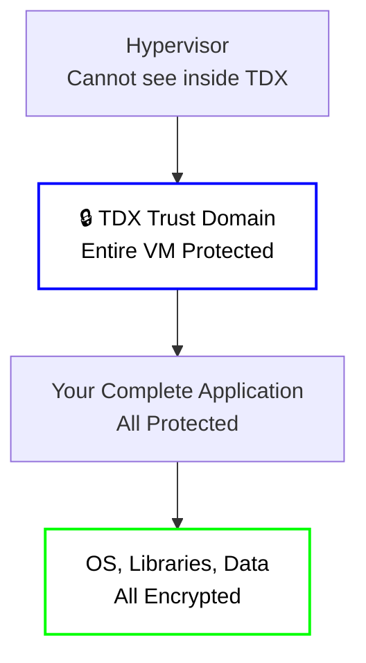
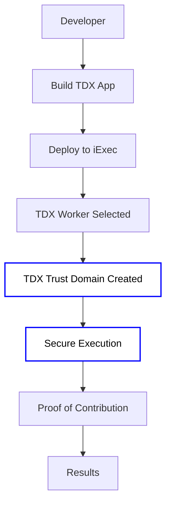

# Intel TDX Technology

**Intel TDX (Trust Domain Extensions)** is Intel's confidential computing
technology that provides VM-level protection. On the iExec platform, TDX is the
**standard technology** for confidential computing, offering advanced
capabilities for memory-intensive workloads and legacy application migration.

## What is Intel TDX?

**TDX (Trust Domain Extensions)** is Intel's newer confidential computing
technology that provides VM-level protection, allowing entire virtual machines
to run in secure, isolated environments.

### Key TDX benefits

1. **🔄 Lift-and-Shift Compatibility**: Run existing applications with minimal
   changes
2. **💾 Large Memory Support**: Handle memory-intensive workloads (AI,
   databases)
3. **🛡️ VM-Level Protection**: Protect entire virtual machines, not just
   applications
4. **⚡ Better Performance**: Optimized for complex workloads

## TDX: The "Virtual Machine-Level" Security

**Intel TDX** is like having an **entire secure building** where you can move
your existing operations without major renovations. It protects entire virtual
machines.

### Key characteristics

- **Scope**: Protects entire virtual machines
- **Memory**: Large secure memory space (like a large vault)
- **Code Changes**: Minimal changes needed - "lift and shift" approach
- **Use Case**: Ideal for complex applications, legacy systems, and AI workloads

**Analogy**: TDX is like moving your entire office into a secure building where
everything is protected.

### Visual representation

## TDX Technology Details

### How TDX works

1. **Trust Domain Creation**: TDX creates secure virtual machines called "Trust
   Domains"
2. **VM-Level Isolation**: Entire virtual machines run in isolated, secure
   environments
3. **Large Memory Support**: Multi-GB+ secure memory space for demanding
   workloads
4. **Legacy Compatibility**: Existing applications can run with minimal
   modifications

### TDX Advantages

- **Large Memory**: Multi-GB+ secure memory space for memory-intensive workloads
- **Easier Migration**: "Lift and shift" approach for existing applications
- **Better Performance**: Optimized for complex, memory-intensive workloads
- **VM-Level Security**: Protects entire virtual machines, not just applications

## TDX with iExec

iExec uses TDX as the standard technology for confidential computing on the
platform.

### iExec's TDX Infrastructure

iExec provides full TDX support through:

- **⚙️ TDX Worker Pools**: TDX-enabled workers for confidential execution
- **📦 TDX Technology Support**: Integration with Intel TDX technology
- **🔐 Secret Management Service**: SMS support for TDX applications
- **📋 Task Verification**: Proof of contribution for TDX executions
- **🔗 Blockchain Integration**: Decentralized coordination and payment

### iExec TDX Workflow

## When to Use TDX

**TDX is ideal for**:

- 💾 Working with memory-intensive applications
- 🔄 Running existing applications with minimal changes
- 🚀 Running complex workloads with VM-level protection

## What's Next?

**Ready to build with TDX?** Check out the practical guides:

- **[Build Intel TDX iApp](/guides/build-iapp/advanced/build-your-first-tdx-iapp)** -
  Build TDX applications with traditional deployment and iApp Generator
- **[Deploy & Run](/guides/build-iapp/deploy-&-run)** - Deploy and run your iApp
- **[Introduction to TEE Technologies](/protocol/tee/introduction)** -
  Understanding TEE foundations
