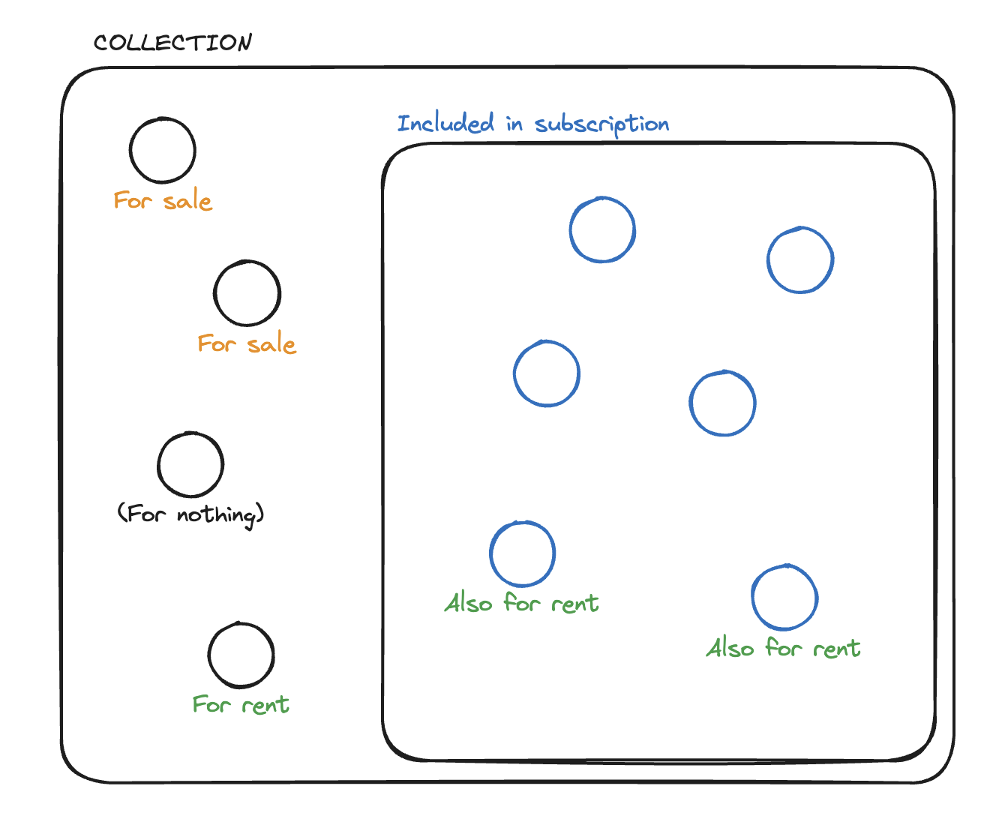

# Data Sharing - Collection Methods <ChainNotSupportedBadge />

A collection is a way to group protected data for sharing by the Data Sharing
module. The Data Sharing smart contract operates on data contained within a
collection. You must group data within a collection before choosing a method of
distribution. The data owner is not restricted to only a single collection. This
diagram illustrates all the options for protected data within a collection:

## Distribution Options

The distribution choice impacts the visibility of the protected data when a
potential consumer is browsing the collection. Inside a collection, a data owner
may specify one of the following states:

**Not distributed**

Only the collection's owner can see it. This is useful for things in
development, or when the owner wishes to release things for a limited time.

**For rent**

The collection's owner allows a consumer to pay a set price to access the data
for a predetermined period of time. The smart contract ensures the consumer
maintains access. Even if the collection owner de-lists the data or changes the
rental terms, the consumer maintains their access for the duration of their
rental term. Once the rental term is up, the consumer loses access to the
protected data. If the user wishes to re-up their rental term, they are bound to
any new price or duration changes the data owner makes.

**Free**

This functions the same as a rental but with no price for the transaction. The
data owner may still set a duration for the free access. This supports scenarios
like a free giveaway, or a timed promotion.

**Included in Subscription**

The collection's owner may create one or more subscription models for
distribution of their data. A subscription bundle is a subset of the protected
data within the collection. Subscribers pay a set fee at a set cadence to
maintain access to all protected data within the subscription. The collection
owner may assign protected data to more than one subscription bundles at the
same time.

The collection owner may add additional protected data to the subscription at
any time. They may not, however, remove protected data from the subscription
bundle if there are any active subscribers. A subscriber maintains access to all
protected data within the subscription as long as they continue paying the
subscription fee. The collection owner may de-list a subscription bundle by
setting either the price, the duration, or both, to zero.

**Both For Rent and Included in Subscription**

The collection owner may set any combination of rental and subscription terms
for any protected data in the collection.

**For sale**

The collection owner may list any of their protected data for sale. This is
especially useful for dealers of digital assets like NFTs.

