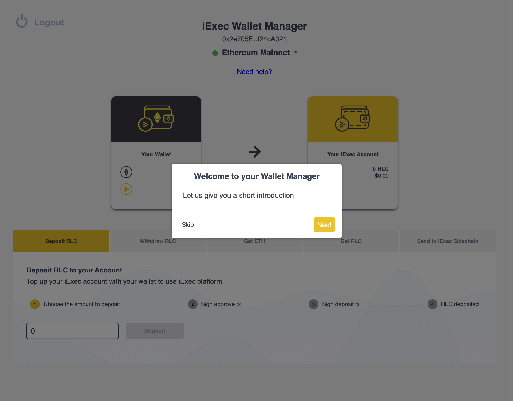
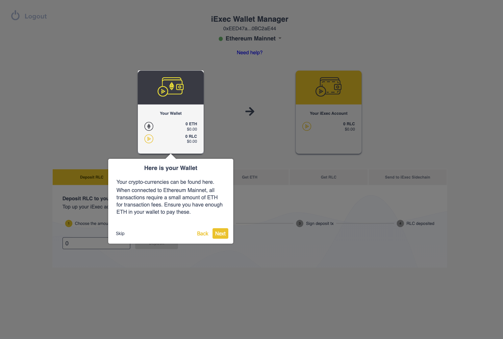
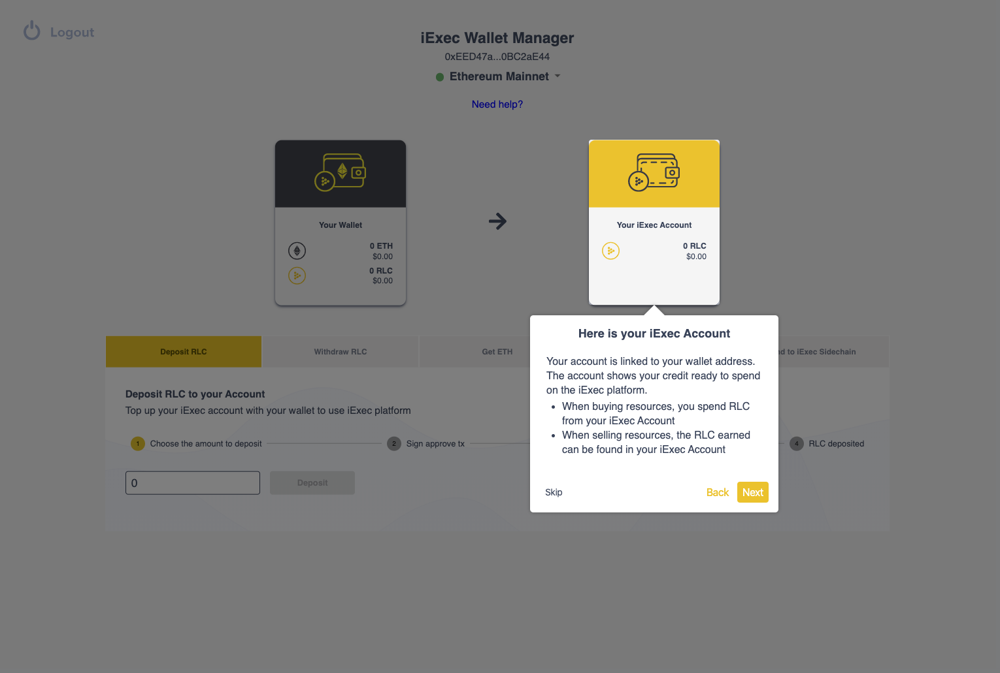
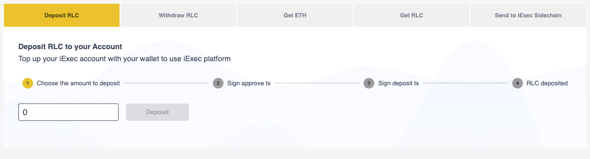
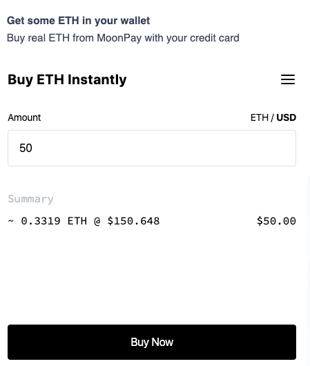

# Wallet with UI

## Wallet Manager

### Choose a Wallet for connect

You can choose **Metamask** if you already familiar blockchain, tokens, and wallets, or **Portis** if you never used blockchain wallet.

#### **Metamask**

Ille vivere. Ut ad te quaerebam ... purgare caeli. Sunt uh ... nonnullus propter errorem qui de rebus inter nos et iacere puto suus in causa, id est in mensa.

#### **Portis**

Ille vivere. Ut ad te quaerebam ... purgare caeli. Sunt uh ... nonnullus propter errorem qui de rebus inter nos et iacere puto suus in causa, id est in mensa.

### Guide UI

Loquélæ. Brevis oratio. Hodie particeps tua perdideris. Quid sui nominis - Emilio? Emilio gradiens ad carcerem. Tulitque omnem pecuniam tuam in DEA tuus Lab. Vos got nihil. Quadratum unum. Et ego agnosco rem, nisi te scire elit. Cogito ... maybe vos possem socium ascendit.

**Wallet address**

This wallet address is your public identity on the blockchain.  
  
**Chain selector**

You can switch from one network to another

* **Testnet** provides a training environment with **free** test crypto-currencies.
* Both **Ethereum Mainnet** and **iExec Sidechain**  use real cryptocurrencies.

Remember

* **Ethereum Mainnet** network is great to build **decentralized** apps.
* **iExec Sidechain** is **cheap** and **fast** but is more centralized.
* The **iExec Sidechain** is linked to **Ethereum Mainnet**. RLC tokens can be transferred between them.

**Here is your Wallet**  
  
Your crypto-currencies can be found here. When connected to Ethereum Mainnet, all transactions require a small amount of ETH for transaction fees. Ensure you have enough ETH in your wallet to pay these.

**Here is your iExec Account**

Your account is linked to your wallet address. The account shows your credit ready to spend on the iExec platform.

* When buying resources, you spend RLC from your iExec Account
* When selling resources, the RLC earned can be found in your iExec Account

## What you can do with Wallet Manager

### Deposit RLC

Use **Deposit RLC** to top up your iExec Account with funds from your wallet.

### Withdraw RLC

Use **Withdraw RLC** to withdraw the RLC from your iExec Account to your wallet.

### Get ETH with Moonpay

MoonPay is a fintech company that enables web and mobile developers to let their users purchase virtual currencies using their everyday credit card. MoonPay integrates with banks and online crypto exchanges to fulfil the entire purchase process.

  
So iExec choose this company..................

### Get RLC

You will need RLC tokens to use the iExec platform  
Click Get RLC to refill your wallet with RLC.  
Expliquer que passe de Wallet -&gt; Account

### Send to iExec Sidechain

How use the sidechain

You will need some RLC tokens to use the iExec platform on Ethereum Mainnet.

Click Send to iExec Sidechain to transfer some RLC from your wallet to iExec Sidechain.


**Remember**:

1 xRLC on iExec Sidechain has the same value than 1 RLC on Ethereum Mainnet.

You can then transfer xRLC from iExec Sidechain back to Ethereum Mainnet.


### Send to Ethereum Mainnet

Use **Send to Ethereum Mainnet** to transfer some xRLC from your wallet to Ethereum Mainnet.Remember:

* 1 RLC on Ethereum Mainnet has the same value than 1 xRLC on iExec Sidechain.
* You can then transfer RLC from Ethereum Mainnet back to iExec Sidechain.

